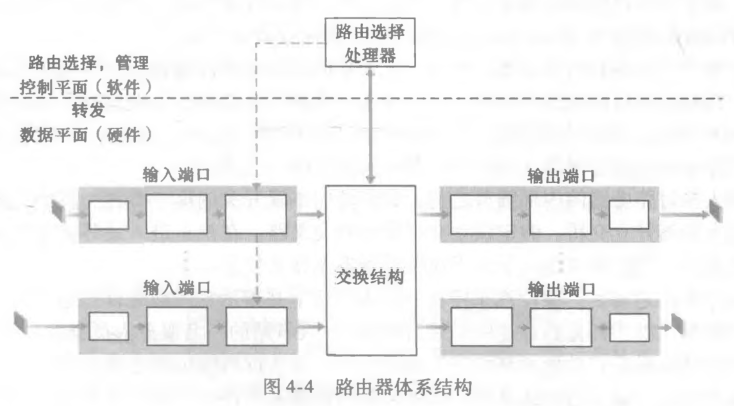

# 路由器体系结构与交换结构

## 路由器体系结构分为哪两部分？

- 数据平面: 硬件实现, 包含输入端口、交换结构、输出端口;
- 控制平面: 软件实现, 由路由选择处理器承担;

## 输入端口处理哪些工作？

- 线路端接;
- 数据链路处理;
- 查找、转发与排队;
- 最后把分组送入交换结构;

## 转发表如何匹配？

- 规则: 使用最长前缀匹配;
- 过程: 在转发表中找出与目的地址匹配且前缀最长的表项, 按该表项对应的链路接口转发;

## 交换结构有哪三种实现？

| 方式       | 机制                                      | 瓶颈                   |
| ---------- | ----------------------------------------- | ---------------------- |
| 经内存交换 | 用内存搬运分组, 同一时刻只能读写一次      | 内存带宽               |
| 经总线交换 | 所有端口共享一条总线                      | 同一时刻只允许一个分组 |
| 经互联网络 | 用 2N 条总线构成互联网络连接 N 个输入输出 | 可并行, 吞吐量最高     |

## 输出端口处理哪些工作？

- 离开交换结构;
- 排队;
- 数据链路处理;
- 线路端接;

