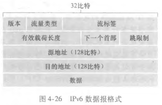

# IPv6 与隧道迁移

## IPv6 的地址与报文有什么变化？

- 地址长度: 128 bit;
- 报文组成: 首部字段与数据字段, 数据字段承载 TCP 或 UDP 报文段;

## IPv6 相比 IPv4 去掉了什么？

- 不支持在中间路由器进行数据报的分片与组装;
- 没有首部检验和字段;

## 如何从 IPv4 迁移到 IPv6？

- 问题: 现网中大量路由器只支持 IPv4, 无法同时升级;
- 方案: 建隧道 (tunneling);
- 做法: 把 IPv6 数据报整体放入 IPv4 数据报的数据字段中, 由 IPv4 中间路由器中转;
- 出口: 对端 IPv6 路由器取出内层数据报, 继续按 IPv6 转发;
