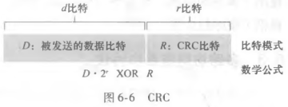
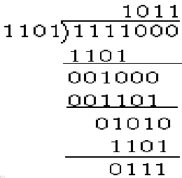

# 循环冗余检测 CRC

## CRC 的基本原理是什么？

- 别名: 循环冗余检测又称多项式编码;
- 参数协商: 发送方与接收方事先约定一个 `r + 1` 比特的生成多项式 `G`;
- 目标: 让发送的 `d + r` 比特串能被 `G` 在模 2 算术下整除;
- 地位: 实际链路层中最常用的差错检测技术;

## 发送方如何生成 CRC？

1. 取 `d` 比特数据字段 `D`;
2. 在 `D` 后面追加 `r` 个 0;
3. 用 `G` 对该 `d + r` 比特串做模 2 除法, 得到 `r` 位余数;
4. 用余数替换追加的 `r` 个 0, 一起发送;

## 接收方如何校验？

- 做法: 用约定的 `G` 对收到的 `d + r` 比特做模 2 除法;
- 判定: 余数为 0 认为无差错, 否则认为出错;

## 模 2 整除如何计算？

- 规则: 每一位的结果不影响其他位, 不存在借位与进位;
- 实质: 按位异或;
- 示例: 用长除法逐位异或, 直到余数位数小于 `G` 的位数;

