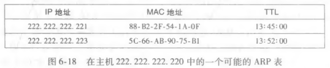

# MAC 地址与 ARP

## MAC 地址是什么？

- 定义: 主机与路由器网络接口的链路层地址;
- 长度: 6 字节, 通常以十六进制表示;
- 作用域: 仅在本地链路内有效, 跨子网时靠网络层地址寻址;
- 广播地址: `FF-FF-FF-FF-FF-FF`;

## ARP 解决什么问题？

- 语义: 地址解析协议, 在 IP 地址与 MAC 地址之间转换;
- 范围: 只为同一子网内的主机与路由器解析 IP 地址;
- 层次: 跨越链路层与网络层;

## ARP 查询与响应分别用什么帧？

- ARP 表: 每台主机与路由器都维护一份 IP 到 MAC 的映射表;
- 查不到时: 用 MAC 广播地址发送 ARP 查询分组, 分组中包含源 MAC、源 IP 与目标 IP;
- 帧类型: 查询报文使用广播帧, 响应报文使用标准帧;
- 更新: 收到响应后把映射写入 ARP 表;

## 发送数据到子网外经过哪些步骤？

1. 子网 1 的主机用 ARP 获得网关路由器的 MAC 地址;
2. 主机把帧发送给网关路由器;
3. 网关路由器用 ARP 获得子网 2 中目标主机的 MAC 地址;
4. 网关路由器把帧转发给子网 2 内的目标主机;

