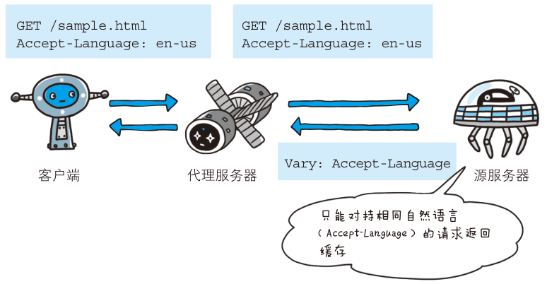

# HTTP 请求与响应首部

## 请求首部字段有哪些？

| 字段                  | 作用                                                                  |
| --------------------- | --------------------------------------------------------------------- |
| `Accept`              | 客户端支持的媒体类型与优先级, `q` 取值 0~1 默认 1, `*/*` 表示任意类型 |
| `Accept-Charset`      | 支持的字符集与优先级                                                  |
| `Accept-Encoding`     | 支持的内容编码与优先级, 如 `gzip, deflate`                            |
| `Accept-Language`     | 支持的自然语言与优先级                                                |
| `Authorization`       | 客户端认证信息, 用于 401 之后重发                                     |
| `Expect`              | 期待服务端出现的行为, 如 `100-continue`                               |
| `From`                | 客户端邮箱地址                                                        |
| `Host`                | 目标服务器 URL, 必须携带                                              |
| `Max-Forwards`        | 最大转发次数, 作用于 `TRACE` 与 `OPTIONS`                             |
| `Proxy-Authorization` | 对代理服务器的认证信息                                                |
| `Range`               | 请求的字节范围, 如 `bytes=5001-10000`                                 |
| `Referer`             | 发起请求的页面 URL                                                    |
| `TE`                  | 可接受的传输编码, 作用在传输编码而非内容编码                          |
| `User-Agent`          | 浏览器与客户端种类                                                    |
| `Cookie`              | 客户端保存并回传的状态信息                                            |

- 条件请求字段 `If-Match`、`If-None-Match`、`If-Modified-Since`、`If-Unmodified-Since`、`If-Range` 的判定语义见 [HTTP 缓存机制](./070-HTTP缓存机制.md);
- `Cookie` 的完整流程见 [Cookie 与状态管理](./080-Cookie与状态管理.md);

## 响应首部字段有哪些？

| 字段                 | 作用                                           |
| -------------------- | ---------------------------------------------- |
| `Accept-Ranges`      | 服务器能否处理范围请求, 取值 `bytes` 或 `none` |
| `Age`                | 响应在缓存中已存活的秒数                       |
| `ETag`               | 资源唯一标识, 用于协商缓存                     |
| `Location`           | 引导客户端访问的 URL, 常配 3XX                 |
| `Proxy-Authenticate` | 代理要求的认证信息                             |
| `Retry-After`        | 建议客户端重试的等待时间, 常配 3XX 与 503      |
| `Server`             | 服务端 Web 服务器信息                          |
| `Vary`               | 缓存判定字段, 仅该字段相同的请求才复用缓存     |
| `Set-Cookie`         | 通知客户端保存状态信息                         |

## 实体首部字段有哪些？

| 字段               | 作用                                                |
| ------------------ | --------------------------------------------------- |
| `Allow`            | 资源支持的 HTTP 方法                                |
| `Content-Encoding` | 主体使用的内容编码, 如 `gzip`                       |
| `Content-Language` | 主体使用的自然语言                                  |
| `Content-Length`   | 主体的字节长度                                      |
| `Content-Location` | 主体对应的 URL, 与 `Location` 不同                  |
| `Content-MD5`      | 主体的 MD5 摘要                                     |
| `Content-Range`    | 主体在完整资源中的范围, 如 `bytes 5001-10000/10000` |
| `Content-Type`     | 主体的 MIME 类型与字符集                            |
| `Expires`          | 实体失效时间, HTTP/1.0 的强缓存字段                 |
| `Last-Modified`    | 资源最后被修改的时间                                |

- 范围请求字段的配合见 [内容协商与编码](./090-内容协商与编码.md);
