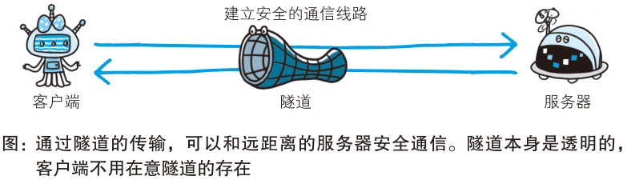
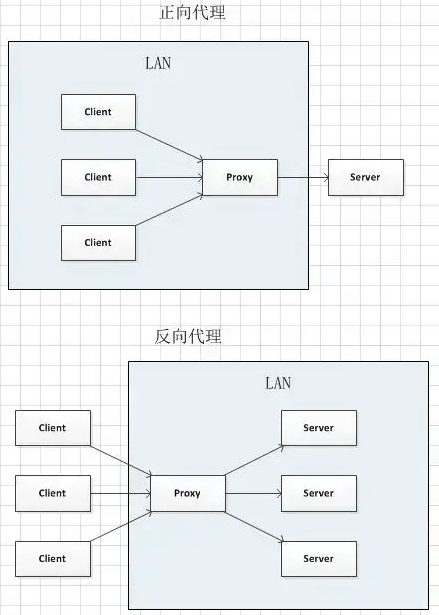

# 代理、网关与隧道

## 代理在 HTTP 通信中扮演什么角色？

- 代理: 客户端与服务端之间的中间商, 接收客户端请求并转发给服务器, 再把服务器响应转发回客户端;
- 作用: 基于缓存减少网络带宽、控制访问、集中日志管理;
- 痕迹: 经过代理时会在报文中写入 `Via` 首部字段;

## 代理如何分类？

- 按是否使用缓存: 缓存代理 / 非缓存代理;
- 按是否加工报文: 透明代理(不加工转发) / 非透明代理(加工转发);

## 网关和隧道与代理有什么区别？

- 网关: 转发其他服务器数据的服务器, 可以把 HTTP 协议转换为其他通信协议;
- 隧道: 在客户端与服务器之间建立通信线路, 使用 SSL 加密通信;
- 关系: 代理与网关转发内容, 隧道只转发字节流;

## 正向代理与反向代理有什么区别？

- 正向代理: 客户端的代理, 转发客户端请求到服务器; 隐藏客户端, 用于 VPN、内网穿透;
- 反向代理: 服务器的代理, 接收客户端请求并转发给内部服务器; 隐藏服务器, 用于负载均衡、缓存与安全控制;

