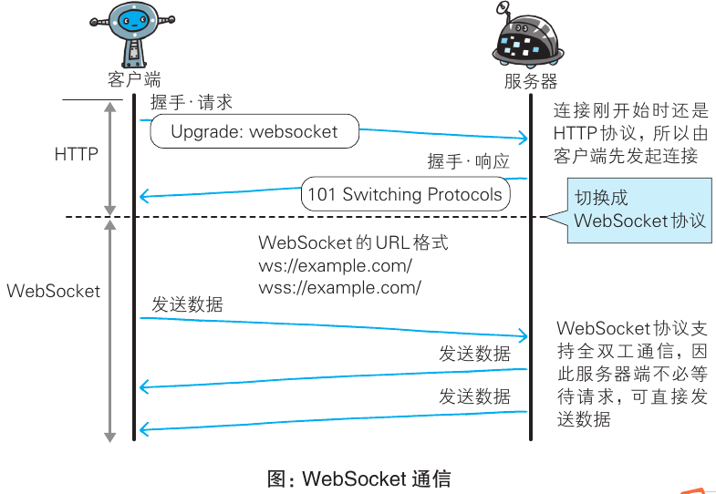

# WebSocket 与实时推送

## 实时推送有哪些方案, 各自代价是什么？

| 方案      | 机制                             | 特点                                   |
| --------- | -------------------------------- | -------------------------------------- |
| 短轮询    | 客户端每隔一定时间发送 HTTP 请求 | 实现简单; 重复建立连接, 有延迟         |
| 长轮询    | 服务端保持请求直到资源变化或超时 | 减少无效请求; 有延迟, 需服务端保持连接 |
| SSE       | 服务端推送, 持久连接单向通信     | 实时性高, 只能服务端到客户端           |
| WebSocket | 全双工持久连接                   | 实时性高, 性能耗费较大                 |

- 长轮询的循环方式: 客户端收到响应后立即重新发起请求;

```typescript
async function subscribe() {
  let response = await fetch("/subscribe");
  if (response.status == 502) {
    // 服务器超时重新连接
    await subscribe();
  } else if (response.status != 200) {
    // 服务器报错, 一秒后重新连接
    await new Promise((resolve) => setTimeout(resolve, 1000));
    await subscribe();
  } else {
    // 正确处理, 执行若干处理程序后继续
    await subscribe();
  }
}
```

## WebSocket 的握手过程是怎样的？

- 基础: 基于 HTTP/HTTPS 发起, 一次握手后不再使用 HTTP/HTTPS 协议;
- 客户端请求:
  - `Upgrade: websocket` 告知服务器改用 WebSocket 协议;
  - `Sec-WebSocket-Key` 作为标识 key;
  - `Sec-WebSocket-Protocol` 声明支持的协议;
- 服务端响应:
  - 返回 101 状态码;
  - `Sec-WebSocket-Protocol` 选定协议;
  - 基于 `Sec-WebSocket-Key` 构造 `Sec-WebSocket-Accept`;
- 客户端确认: 校验 `Sec-WebSocket-Accept`, 通过后建立连接;

```bash
# 请求
GET /chat HTTP/1.1
Host: server.example.com
Upgrade: websocket
Connection: Upgrade
Sec-WebSocket-Key: dGhlIHNhbXBsZSBub25jZQ==
Origin: http://example.com
Sec-WebSocket-Protocol: chat, superchat
Sec-WebSocket-Version: 13

# 响应
HTTP/1.1 101 Switching Protocols
Upgrade: websocket
Connection: Upgrade
Sec-WebSocket-Accept: s3pPLMBiTxaQ9kYGzzhZRbK+xOo=
Sec-WebSocket-Protocol: chat
```



## WebSocket 相对轮询有哪些优势？

- 全双工: 支持真正的实时推送, 优于轮询;
- 网络开销低: 一次握手后持久保持连接, 避免反复建连;
- 数据量小: 以二进制数据帧传输, 传输效率高;
- 支持跨域: 不受同源策略限制, 见 [同源策略与跨域](../060-HTTP/110-同源策略与跨域.md);
