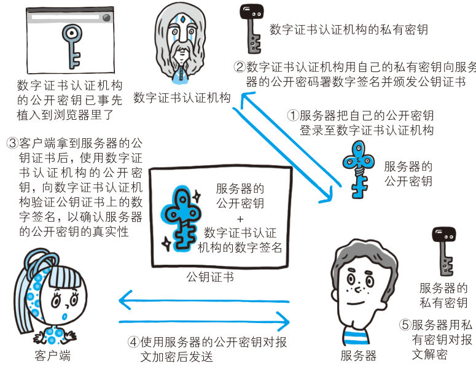

# 数字证书与信任链

## 为什么混合加密还需要数字证书？

- 混合加密只能保证公钥被安全转发, 不能保证拿到的公钥属于真正的服务端;
- 传输途中存在公钥被掉包的风险;
- 证书由可信赖的第三方机构 CA (数字证书认证机构) 签发, 用于证明公钥归属;

## CA 如何签发与校验证书？

- 签发流程:
  - 服务端向 CA 申请公钥的数字签名;
  - CA 对明文信息做散列算法得到信息摘要;
  - CA 用自己的私有密钥加密信息摘要, 生成证书签名;
  - 签名与公钥等明文信息一起构成公开密钥证书;
- 校验流程:
  - 浏览器事先保存 CA 的公开密钥;
  - 用相同散列算法对证书明文生成信息摘要;
  - 用 CA 公钥解密证书签名;
  - 两者一致则证书合法, 公钥可信;

## 自签名证书是怎么来的？

- 用 OpenSSL 可以搭建私有认证机构, 即自认证机构;
- 由自认证机构颁发的证书称为自签名证书, 不会被浏览器默认信任;
