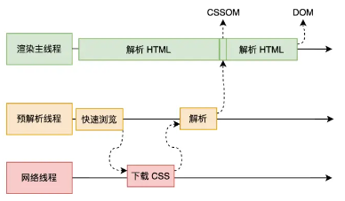
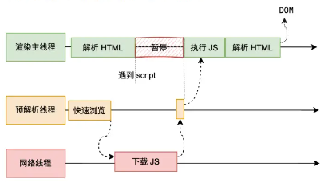

# 页面渲染流程

## 从 HTML 到像素要经历哪些步骤？

- 构建 DOM 树: 解析 HTML;
- 构建 CSSOM 树: 计算 CSS;
- 解析 JS;
- 构建渲染树: 合并 DOM 与 CSSOM, 只保留显示节点及其样式信息;
- 构建布局树: 计算元素的位置与大小;
- 分层: 对布局树分层, 使后续渲染只需要处理某一层;
- 绘制: 为各图层生成绘制指令;
- 合成: 交由 GPU 显示;
  - 分块: 把图层切成块;
  - 光栅化: 生成像素位图;
  - 绘制: 上屏;

## HTML、CSS、JS 的解析过程有什么区别？

- 解析 HTML: 字节数据 → 字符串 → token → Node → DOM;

- 解析 CSS: 同样的转换链得到 CSSOM; CSS 在预解析线程执行, 不阻塞 HTML 解析, 但会阻塞渲染树构建, 进而阻塞渲染;

- 解析 JS: 会阻塞 HTML 解析, 因为 JS 可能修改当前 DOM;

- 构建渲染树: 合并 DOM 树与 CSSOM 树, 包含显示节点及其样式信息;

## 哪些操作会由 GPU 加速？

- 页面滚动;
- `transform` 变换;
- CSS 动画;
- `canvas` 绘图;
