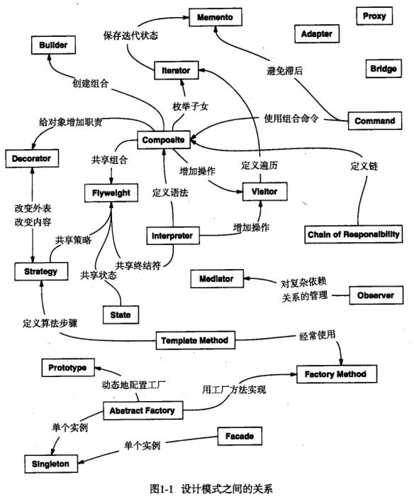

# 设计模式概览

## 设计模式是什么？

- 定义: 一种通用设计结构, 用于构造可复用的面向对象设计;
- 本质: 对反复出现的类与对象协作方式命名, 与具体语言和语法无关;
- 用途: 提供共同词汇, 让讨论从"某个类怎么写"上升到"职责如何分配";

## 设计模式分为哪几类？

| 类型   | 关注点         | 包含的模式                                                                         |
| ------ | -------------- | ---------------------------------------------------------------------------------- |
| 创建型 | 对象的创建     | 工厂方法、抽象工厂、生成器、原型、单例                                             |
| 结构型 | 类与对象的组合 | 适配器、桥接、组合、装饰、外观、享元、代理                                         |
| 行为型 | 类与对象的交互 | 职责链、命令、解释器、迭代器、中介者、备忘录、观察者、状态、策略、模板方法、访问者 |

- 分类依据: 目的, 而不是实现手段;

## 模式之间是什么关系？

- 协作: 模式常组合出现, 例如抽象工厂借助工厂方法创建一组产品, 见 [抽象工厂](../020-创建型/020-抽象工厂.md);
- 选择: 同一个问题常有多种模式解法, 取舍取决于变化点在哪一侧;

## 使用设计模式时遵循哪些原则？

- 面向接口编程: 依赖抽象而不是具体实现;
- 组合优于继承: 复用逻辑优先用组合与委托, 见 [组合优于继承](./030-组合优于继承.md);
