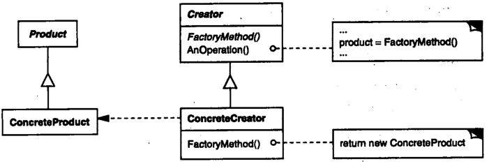

# 工厂方法

## 工厂方法模式解决什么问题？

- 问题: Creator 知道要创建一个 Product, 但不知道具体创建哪一个实现类;
- 解法: 把实例化延迟到子类, 由不同的 ConcreteCreator 创建不同的 ConcreteProduct;
- 收益: 新增产品只需新增 Creator 子类, 不必修改已有创建流程;

## 工厂方法模式包含哪些角色？

- Product: 声明 ConcreteProduct 需要实现的方法;
- ConcreteProduct: 实现 Product 的实例类;
- Creator: 声明工厂方法, 其返回值类型为 Product;
- ConcreteCreator: 重写工厂方法, 返回某个 ConcreteProduct;



## 如何用 TypeScript 实现工厂方法模式？

```typescript
interface Interviewer {
  askQuestions(): void;
}

class Programmer implements Interviewer {
  askQuestions(): void {
    console.log("Asking about program.");
  }
}

class Farmer implements Interviewer {
  askQuestions(): void {
    console.log("Asking about farm.");
  }
}

// Creator: 模板方法依赖工厂方法, 不依赖具体产品
abstract class HiringManager {
  protected abstract makeInterviewer(): Interviewer;

  takeInterview(): void {
    this.makeInterviewer().askQuestions();
  }
}

// ConcreteCreator: 每个子类决定实例化哪个产品
class DevelopmentManager extends HiringManager {
  protected makeInterviewer(): Interviewer {
    return new Programmer();
  }
}

class MarketingManager extends HiringManager {
  protected makeInterviewer(): Interviewer {
    return new Farmer();
  }
}
```

## 如何使用与扩展工厂方法模式？

- 使用: 调用 Creator 上依赖工厂方法的模板方法;

```typescript
new DevelopmentManager().takeInterview(); // Asking about program.
new MarketingManager().takeInterview(); // Asking about farm.
```

- 扩展: 新增一个产品时同时新增对应的 ConcreteCreator, 已有 Creator 不需要改动;
