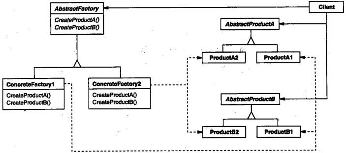

# 抽象工厂

## 抽象工厂模式解决什么问题？

- 问题: 需要创建一族互相关联的产品, 但不想暴露具体产品类;
- 解法: 把创建一组相关产品的方法收进同一个工厂接口, 强调产品之间的一致性;
- 关系: 抽象工厂内部通常借助工厂方法实现, 见 [工厂方法](./010-工厂方法.md);

## 抽象工厂模式包含哪些角色？

- AbstractFactory: 声明 ConcreteFactory 需要实现的创建方法;
- ConcreteFactory: 实现创建方法, 返回一组配套的具体产品;
- AbstractProduct: 声明产品需要实现的方法;
- Product: 实现 AbstractProduct;
- Client: 只依赖 AbstractFactory 与 AbstractProduct 编写逻辑;



## 如何用 TypeScript 实现抽象工厂模式？

```typescript
interface Door {
  getDescription(): string;
}
class WoodenDoor implements Door {
  getDescription() {
    return "I am a wooden door";
  }
}
class IronDoor implements Door {
  getDescription() {
    return "I am an iron door";
  }
}

interface DoorExpert {
  getDescription(): string;
}
class Carpenter implements DoorExpert {
  getDescription() {
    return "I can only fit wooden doors";
  }
}
class Welder implements DoorExpert {
  getDescription() {
    return "I can only fit iron doors";
  }
}

// AbstractFactory: 成组创建互相配套的产品
interface DoorFactory {
  makeDoor(): Door;
  makeFittingExpert(): DoorExpert;
}

// ConcreteFactory: 保证同一族产品一起使用
class WoodenDoorFactory implements DoorFactory {
  makeDoor(): Door {
    return new WoodenDoor();
  }
  makeFittingExpert(): DoorExpert {
    return new Carpenter();
  }
}

class IronDoorFactory implements DoorFactory {
  makeDoor(): Door {
    return new IronDoor();
  }
  makeFittingExpert(): DoorExpert {
    return new Welder();
  }
}
```

## 如何使用抽象工厂模式？

- 使用: 先实例化 ConcreteFactory, 再通过它创建同一族的多个产品, Client 看不到具体产品类;

```typescript
const factory: DoorFactory = new WoodenDoorFactory();
const door = factory.makeDoor();
const expert = factory.makeFittingExpert();
door.getDescription(); // I am a wooden door
expert.getDescription(); // I can only fit wooden doors
```

## 抽象工厂模式有什么代价？

- 优点: 隐式创建产品, Client 不需要显式引用具体产品类;
- 缺点: 工厂接口难以扩展, 增加一个新创建方法需要改动所有 ConcreteFactory;
