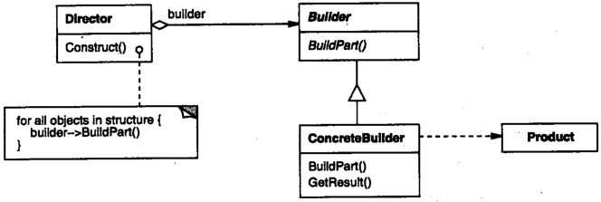

# 生成器

## 生成器模式解决什么问题？

- 问题: 复杂对象的创建步骤较多, 创建逻辑与表示形式容易缠在一起;
- 解法: 把复杂对象的构建过程从它的表示中分离, 由 Builder 承担装配步骤;
- 收益: 同一套构建过程可以产出不同的表示;

## 生成器模式包含哪些角色？

- Builder: 声明 ConcreteBuilder 需要实现的装配方法与取回产品的方法;
- ConcreteBuilder: 实现 Builder, 决定产品的具体部件;
- Director: 持有 Builder 实例, 按固定顺序调用装配方法;
- Product: 被创建的复杂对象;



## 如何用 TypeScript 实现生成器模式？

```typescript
class Computer {
  cpu: string | null = null;
  gpu: string | null = null;
}

// Builder: 声明装配步骤与取回产品
interface ComputerBuilder {
  buildCpu(): void;
  buildGpu(): void;
  getComputer(): Computer;
}

// ConcreteBuilder: 决定每个部件具体是什么
class HPBuilder implements ComputerBuilder {
  constructor(private computer: Computer) {}
  buildCpu() {
    this.computer.cpu = "HP cpu";
  }
  buildGpu() {
    this.computer.gpu = "HP gpu";
  }
  getComputer(): Computer {
    return this.computer;
  }
}

class DellBuilder implements ComputerBuilder {
  constructor(private computer: Computer) {}
  buildCpu() {
    this.computer.cpu = "Dell cpu";
  }
  buildGpu() {
    this.computer.gpu = "Dell gpu";
  }
  getComputer(): Computer {
    return this.computer;
  }
}

// Director: 固化装配顺序, 与具体部件无关
class ComputerDirector {
  constructor(private builder: ComputerBuilder) {}

  build(): Computer {
    this.builder.buildCpu();
    this.builder.buildGpu();
    return this.builder.getComputer();
  }
}
```

## 如何使用生成器模式？

- 使用: 先实例化 ConcreteBuilder, 再把它交给 Director, 由 Director 产出 Product;

```typescript
const hp = new ComputerDirector(new HPBuilder(new Computer())).build();
hp.cpu; // HP cpu

const dell = new ComputerDirector(new DellBuilder(new Computer())).build();
dell.gpu; // Dell gpu
```

- 扩展: 新增产品只需要新增 ConcreteBuilder, Director 的装配流程保持不变;
