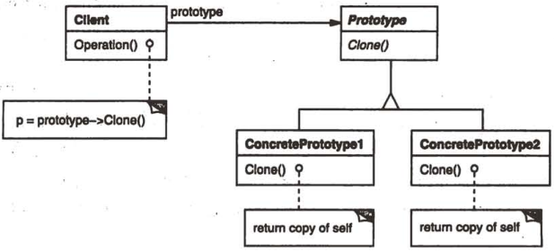

# 原型

## 原型模式解决什么问题？

- 问题: 需要创建的类在运行时才能确定, 且不希望让调用方依赖具体类;
- 解法: 让对象自己提供 `clone()`, 调用方传入一个原型, 拿回它的拷贝;
- 与工厂方法的区别: 工厂方法按类型创建, 原型按实例拷贝;

## 原型模式包含哪些角色？

- Prototype: 声明 ConcretePrototype 需要实现的 `clone()` 方法;
- ConcretePrototype: 实现 `clone()`, 返回自身的一个拷贝;
- Client: 接收 Prototype 实例并返回其拷贝;



- 特殊类: 具备 `clone()` 的类可称为原型类;

## 如何用 TypeScript 实现原型模式？

```typescript
interface ComputerPrototype {
  getName(): string;
  clone(): ComputerPrototype;
}

class HP implements ComputerPrototype {
  constructor(private name: string) {}

  getName(): string {
    return `hp ${this.name}`;
  }

  clone(): ComputerPrototype {
    return new HP(this.name);
  }
}

class Dell implements ComputerPrototype {
  constructor(private name: string) {}

  getName(): string {
    return `dell ${this.name}`;
  }

  clone(): ComputerPrototype {
    return new Dell(this.name);
  }
}

// Client: 只依赖 Prototype 接口
class ComputerFactory {
  getComputer(prototype: ComputerPrototype): ComputerPrototype {
    return prototype.clone();
  }
}
```

## 如何使用原型模式？

```typescript
const hp = new ComputerFactory().getComputer(new HP("computer"));
hp.getName(); // hp computer

const dell = new ComputerFactory().getComputer(new Dell("computer"));
dell.getName(); // dell computer
```

- 边界: `clone()` 需要决定是浅拷贝还是深拷贝; 上例的对象只含原始值, 因此等价于深拷贝;
