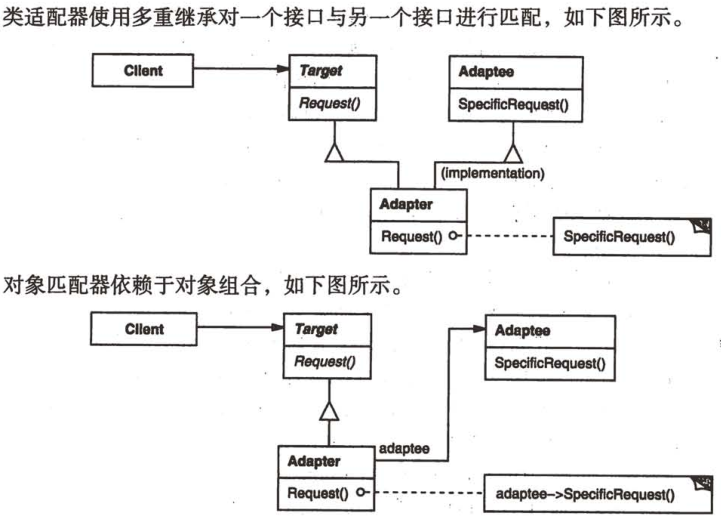

# 适配器

## 适配器模式解决什么问题？

- 问题: 两个类的接口不兼容, 无法直接协作;
- 解法: 插入一个适配器, 把 Adaptee 的接口转换成 Target 期望的形式;
- 特征: 适配器只做接口转换, 不新增业务能力;

## 适配器模式包含哪些角色？

- Target: 调用方期望的接口;
- Adaptee: 需要被适配的已有接口;
- Adapter: 实现 Target, 并把请求转换到 Adaptee;



## 类适配器与对象适配器有什么区别？

- 类适配器: 同时继承 Target 接口与 Adaptee 接口, 在 Target 方法里调用 Adaptee 方法;
- 对象适配器: 只实现 Target 接口, 用组合持有 Adaptee, 在 Target 方法里调用 Adaptee 实例的方法;
- 取舍: 对象适配器不依赖多重继承, 且可替换不同的 Adaptee 实例, 因此更常用;

## 如何用对象适配器实现适配？

```typescript
interface Lion {
  roar(): void;
}

// Client: 只接受 Lion 类型
class Hunter {
  hunt(lion: Lion) {
    lion.roar();
  }
}

// Adaptee: 接口与 Lion 不兼容
class Dog {
  bark() {
    console.log("Dog");
  }
}

// Adapter: 实现 Target 并组合 Adaptee
class DogAdapter implements Lion {
  constructor(private dog: Dog) {}

  roar() {
    this.dog.bark();
  }
}
```

## 如何使用适配器模式？

```typescript
new Hunter().hunt(new DogAdapter(new Dog())); // Dog
```

- 边界: 若接口差异需要改变语义而不只是改名, 适配器会变复杂, 应重新评估两端的抽象;
