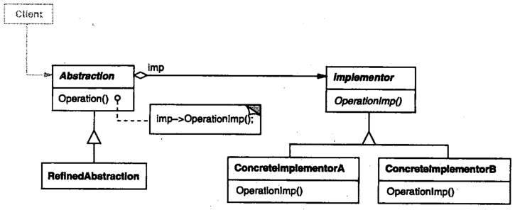
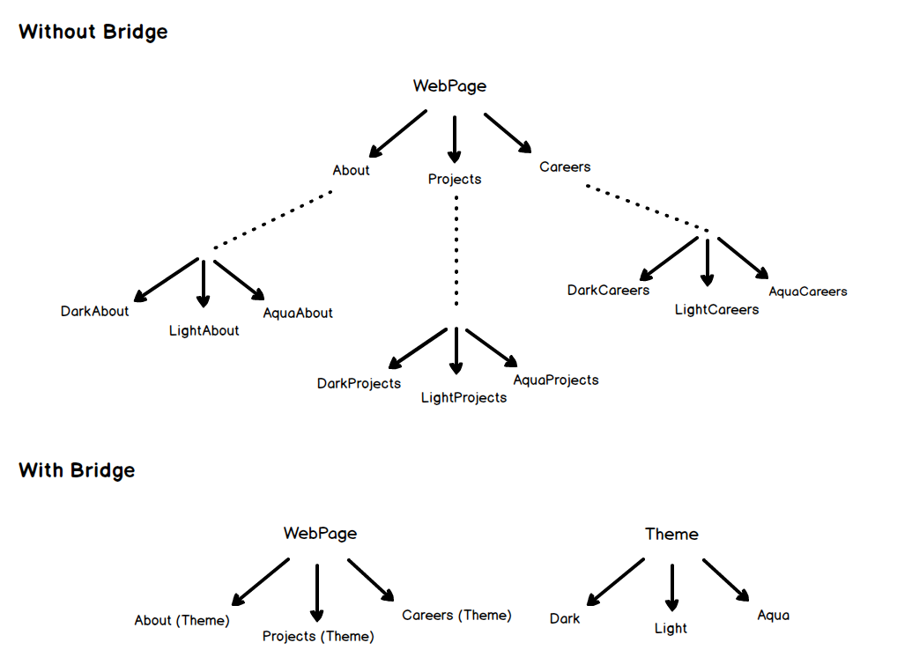

# 桥接

## 桥接模式解决什么问题？

- 问题: 类的抽象与实现被继承绑在一起, 两个维度都要扩展时子类数量爆炸;
- 解法: 把抽象与实现拆成两套独立的继承体系, 用组合把它们连接起来;
- 收益: 抽象与实现可以各自独立变化, 不必一一对应;

## 桥接模式包含哪些角色？

- Abstraction: 抽象接口, 把 Implementor 作为自己的属性, 并将请求转发给它;
- RefinedAbstraction: 在 Abstraction 之上扩展出的抽象;
- Implementor: 实现类接口;
- ConcreteImplementor: Implementor 的具体实现;





## 如何用 TypeScript 实现桥接模式？

```typescript
// Implementor: 实现维度
interface Theme {
  getColor(): string;
}
class DarkTheme implements Theme {
  getColor() {
    return "Dark Black";
  }
}
class LightTheme implements Theme {
  getColor() {
    return "Off white";
  }
}

// Abstraction: 抽象维度, 组合 Implementor
abstract class WebPage {
  constructor(protected theme: Theme) {}

  abstract getContent(): string;
}

class About extends WebPage {
  getContent(): string {
    return `About in ${this.theme.getColor()}`;
  }
}

class Careers extends WebPage {
  getContent(): string {
    return `Careers in ${this.theme.getColor()}`;
  }
}
```

## 桥接模式与委托有什么关系？

- 相同点: 都通过组合持有另一个对象, 并把请求转发过去;
- 桥接的着眼点: 让抽象与实现两个维度各自独立扩展, 转发是结构手段;
- 委托的着眼点: 复用被委托对象的实现, 见 [复用机制与委托](../010-基础/020-复用机制与委托.md);

## 如何使用桥接模式？

```typescript
const darkTheme = new DarkTheme();
new About(darkTheme).getContent(); // About in Dark Black
new Careers(darkTheme).getContent(); // Careers in Dark Black
new About(new LightTheme()).getContent(); // About in Off white
```

- 扩展: 新增主题只新增 Implementor, 新增页面只新增 Abstraction 子类, 两侧互不影响;
