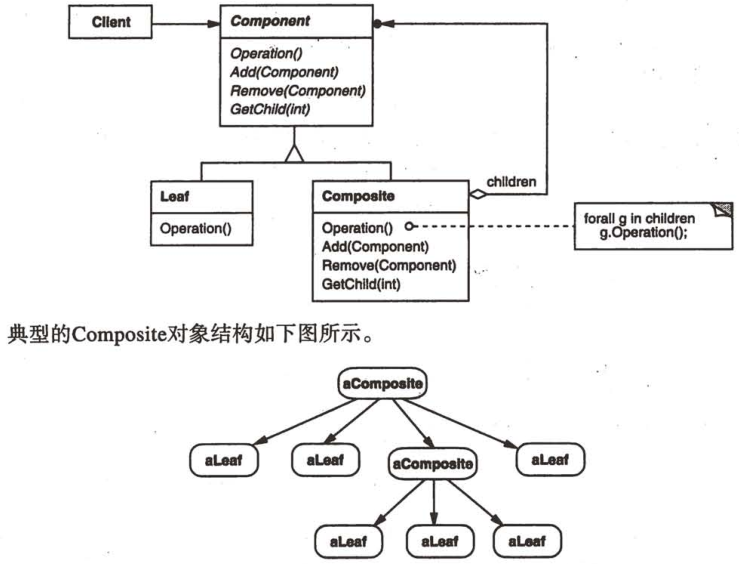

# 组合

## 组合模式解决什么问题？

- 问题: 需要表达整体与部分的树形结构, 且希望调用方对单个对象和整体对象一视同仁;
- 解法: 让 Leaf 与 Composite 实现同一个 Component 接口, Composite 内部持有若干子 Component;
- 收益: 用组合代替继承组织结构, 调用方递归处理整棵树时不需要区分叶子与容器;

## 组合模式包含哪些角色？

- Component: 统一接口, Leaf 与 Composite 都实现它;
- Leaf: 没有子节点的类, 直接给出操作结果;
- Composite: 持有子 Component 的类, 在自己的方法里调用子节点的方法并聚合结果;



## 如何用 TypeScript 实现组合模式？

```typescript
interface FileSystemNode {
  getName(): string;
  getSize(): number;
}

// Leaf: 直接返回自身数据
class File implements FileSystemNode {
  constructor(
    private name: string,
    private size: number,
  ) {}

  getName(): string {
    return this.name;
  }

  getSize(): number {
    return this.size;
  }
}

// Composite: 持有子节点并递归聚合
class Folder implements FileSystemNode {
  private children: FileSystemNode[] = [];

  constructor(private name: string) {}

  getName(): string {
    return this.name;
  }

  add(node: FileSystemNode): void {
    this.children.push(node);
  }

  getSize(): number {
    return this.children.reduce((sum, child) => sum + child.getSize(), 0);
  }
}
```

## 如何使用组合模式？

```typescript
const root = new Folder("root");
root.add(new File("a.txt", 10));

const sub = new Folder("sub");
sub.add(new File("b.txt", 20));
root.add(sub);

root.getSize(); // 30; 调用方无需判断是文件还是目录
```

- 边界: 统一接口要求 Leaf 也实现容器方法时, 会引入无意义方法, 需要按语言手段取舍;
