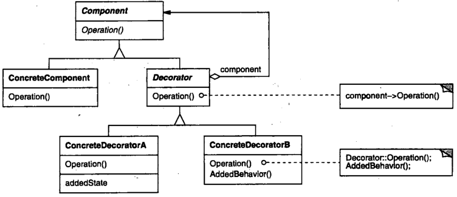

# 装饰

## 装饰模式解决什么问题？

- 问题: 需要在运行时给某个对象动态添加额外行为, 又不想为每种组合派生一个子类;
- 解法: 让装饰器实现 Component 接口并持有一个 Component, 在转发前后附加行为;
- 收益: 可以层层嵌套装饰器, 按需组合出行为组合;

## 装饰模式包含哪些角色？

- Component: 定义统一接口;
- ConcreteComponent: Component 的具体实现, 提供基础行为;
- Decorator: 持有 Component 属性并实现 Component 全部接口, 在转发时修改结果;
- ConcreteDecorator: Decorator 的具体实现, 每层只负责一项附加行为;



## 如何用 TypeScript 实现装饰模式？

```typescript
interface Coffee {
  getCost(): number;
  getDescription(): string;
}

class SimpleCoffee implements Coffee {
  getCost() {
    return 10;
  }
  getDescription() {
    return "Simple coffee";
  }
}

// Decorator: 实现同一接口并持有被装饰对象
class MilkCoffee implements Coffee {
  constructor(protected coffee: Coffee) {}

  getCost() {
    return this.coffee.getCost() + 2;
  }
  getDescription() {
    return `${this.coffee.getDescription()} milk`;
  }
}

class WhipCoffee implements Coffee {
  constructor(protected coffee: Coffee) {}

  getCost() {
    return this.coffee.getCost() + 3;
  }
  getDescription() {
    return `${this.coffee.getDescription()} whip`;
  }
}
```

## 如何使用装饰模式？

```typescript
let coffee: Coffee = new SimpleCoffee();
coffee.getCost(); // 10; "Simple coffee"

coffee = new MilkCoffee(coffee);
coffee.getCost(); // 12; "Simple coffee milk"

coffee = new WhipCoffee(coffee);
coffee.getCost(); // 15; "Simple coffee milk whip"
```

- 顺序: 装饰顺序决定叠加顺序, 调用方只需面向 Component 接口;
- 相关: 装饰与静态代理结构相同, 区别在意图, 见 [代理](./070-代理.md);
