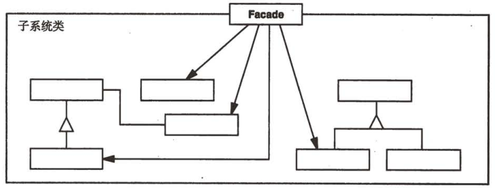

# 外观

## 外观模式解决什么问题？

- 问题: 子系统由多个组件组成, 调用方需要记住组件间的调用顺序与细节;
- 解法: 提供一个高层接口, 把子系统的一组调用封装成一个简单操作;
- 收益: 调用方只依赖外观, 子系统的变化被挡在外观之后;

## 外观模式包含哪些角色？

- Facade: 封装若干 Subsystem class, 对外暴露粗粒度操作;
- Subsystem class: 子系统中的若干组件, 本身不感知 Facade;



## 如何用 TypeScript 实现外观模式？

```typescript
// Subsystem: 各自提供细粒度能力
class Computer {
  getElectricShock() {
    console.log("Ouch!");
  }
  makeSound() {
    console.log("Beep beep!");
  }
  showLoadingScreen() {
    console.log("Loading..");
  }
  bam() {
    console.log("Ready to be used!");
  }
  closeEverything() {
    console.log("Bup bup bup buzzzz!");
  }
  sooth() {
    console.log("Zzzzz");
  }
  pullCurrent() {
    console.log("Haaah!");
  }
}

// Facade: 把调用顺序与细节收在一处
class ComputerFacade {
  constructor(protected computer: Computer) {}

  turnOn() {
    this.computer.getElectricShock();
    this.computer.makeSound();
    this.computer.showLoadingScreen();
    this.computer.bam();
  }

  turnOff() {
    this.computer.closeEverything();
    this.computer.pullCurrent();
    this.computer.sooth();
  }
}
```

## 如何使用外观模式？

```typescript
const facade = new ComputerFacade(new Computer());
facade.turnOn();
facade.turnOff();
```

- 边界: 外观只简化调用, 不阻止调用方直接使用子系统; 若需要完全隔离, 应配合接口约束;
