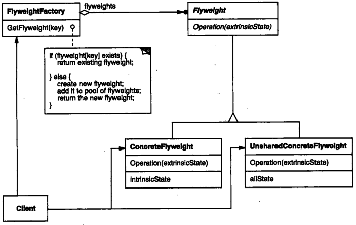

# 享元

## 享元模式解决什么问题？

- 问题: 应用中存在大量对象, 且这些对象的大部分信息可以共享;
- 解法: 把对象信息拆成可共享的内部状态与随场景变化的外部状态, 只共享内部状态;
- 收益: 显著减少同类对象的数量与内存占用;

## 内部状态与外部状态有什么区别？

- 内部状态: 共享对象自身保存的信息, 不随使用场景变化;
- 外部状态: 独立于共享对象的信息, 由使用方传入, 通常放在非共享对象里;

## 享元模式包含哪些角色？

- Flyweight: 对象接口;
- ConcreteFlyweight: 实现 Flyweight, 只存储内部状态;
- UnsharedConcreteFlyweight: 实现 Flyweight, 用组合持有 ConcreteFlyweight, 存储外部状态;
- FlyweightFactory: 用工厂方法与缓存管理 ConcreteFlyweight, 相同内部状态只创建一次;
- Client: 保存多个对 Flyweight 的引用;



## 如何用 TypeScript 实现享元模式？

```typescript
// Flyweight: 接收外部状态作为参数
interface Car {
  getPosition(x: number, y: number): void;
}

// ConcreteFlyweight: 只存内部状态
class CarShared implements Car {
  constructor(private type: string) {}

  getPosition(x: number, y: number): void {
    console.log(`${this.type} in ${x}, ${y}`);
  }
}

// UnsharedConcreteFlyweight: 存外部状态, 组合共享对象
class CarUnshared implements Car {
  constructor(
    private x: number,
    private y: number,
    private shared: CarShared,
  ) {}

  getPosition(): void {
    this.shared.getPosition(this.x, this.y);
  }
}

// FlyweightFactory: 按内部状态缓存共享对象
class CarFactory {
  private static shared = new Map<string, CarShared>();

  static getCarShared(type: string): CarShared {
    let share = this.shared.get(type);
    if (!share) {
      share = new CarShared(type);
      this.shared.set(type, share);
    }
    return share;
  }
}
```

## 如何使用享元模式？

```typescript
CarFactory.getCarShared("kxh") === CarFactory.getCarShared("kxh"); // true; 同类型只创建一次

new CarUnshared(1, 1, CarFactory.getCarShared("kxh")).getPosition(); // kxh in 1, 1
new CarUnshared(2, 2, CarFactory.getCarShared("nnu")).getPosition(); // nnu in 2, 2
```

- 边界: 只有内部状态占比高时收益才明显, 外部状态过多会让共享对象退化为普通对象;
