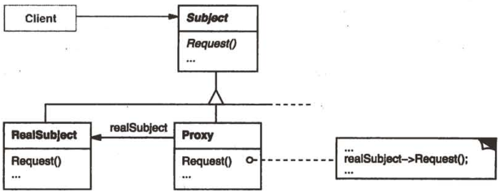

# 代理

## 代理模式解决什么问题？

- 问题: 直接操作某个对象的开销大, 或需要在实际访问前后加控制;
- 解法: 代理实现与真实对象相同的接口, 根据需要决定是否把请求转发给真实对象;
- 收益: 调用方面向接口不变, 访问控制、延迟加载等横切逻辑集中在代理里;

## 代理模式包含哪些角色？

- Subject: 对象接口;
- Proxy: 实现 Subject, 持有对 RealSubject 的引用, 代替它接收请求;
- RealSubject: Subject 的具体实现, 承担真实开销;



## 如何用 TypeScript 实现代理模式？

```typescript
interface Door {
  getPassword(): string;
  open(password: string): void;
  close(): void;
}

class LabDoor implements Door {
  getPassword(): string {
    return "123456";
  }

  open(password: string) {
    console.log(password === this.getPassword() ? "Opening lab door" : "The password is wrong.");
  }

  close() {
    console.log("Closing the lab door");
  }
}

// Proxy: 拦截请求并做访问控制
class SecuredDoor implements Door {
  private password: string;

  constructor(private door: Door) {
    this.password = door.getPassword();
  }

  getPassword(): string {
    return "No right";
  }

  open(password: string) {
    if (password === this.password) {
      this.door.open(password);
    } else {
      console.log("The password is wrong.");
    }
  }

  close() {
    this.door.close();
  }
}
```

## 如何使用代理模式？

```typescript
const door = new SecuredDoor(new LabDoor());
door.getPassword(); // No right; 代理隐藏真实口令
door.open("123456"); // Opening lab door
door.open("123"); // The password is wrong.
door.close(); // Closing the lab door
```

- 相关: 代理与装饰的结构相同, 区别在意图; 装饰是为对象添加行为, 代理是控制对对象的访问, 见 [装饰](./040-装饰.md);
