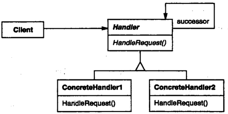

# 职责链

## 职责链模式解决什么问题？

- 问题: 同一请求可能被多个对象处理, 由运行时的条件决定最终由谁处理;
- 解法: 把处理者串成一条链, 每个处理者能处理就处理, 否则转发给后继者;
- 收益: 请求的发送方不需要知道具体由哪个处理者响应;

## 职责链模式包含哪些角色？

- Handler: 处理请求的接口, 内部保存后继者;
- ConcreteHandler: 实现 Handler; 能处理则处理, 否则把请求转给后继者;



## 如何用 TypeScript 实现职责链模式？

```typescript
abstract class Account {
  protected successor: Account | null = null;
  protected name = "account";

  constructor(protected balance: number) {}

  setNext(account: Account): void {
    this.successor = account;
  }

  pay(amount: number): void {
    if (this.balance >= amount) {
      console.log(`Paid ${amount} using ${this.name}`);
    } else if (this.successor) {
      console.log(`Cannot pay using ${this.name}. Proceeding...`);
      this.successor.pay(amount);
    } else {
      console.log("None of the accounts have enough balance");
    }
  }
}

class Bank extends Account {
  protected name = "bank";
}
class Paypal extends Account {
  protected name = "Paypal";
}
class Bitcoin extends Account {
  protected name = "bitcoin";
}
```

## 如何使用职责链模式？

```typescript
const bank = new Bank(100);
const paypal = new Paypal(200);
const bitcoin = new Bitcoin(300);

bank.setNext(paypal);
paypal.setNext(bitcoin);

// Cannot pay using bank. Proceeding...
// Cannot pay using Paypal. Proceeding...
// Paid 259 using bitcoin
bank.pay(259);
```

- 边界: 链上都不处理时请求落空, 需要兜底分支或在链尾放默认处理者;
- 边界: 请求会沿链逐个尝试, 链过长会放大单次调用的开销;
