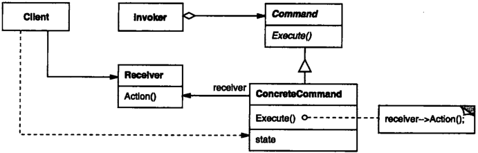

# 命令

## 命令模式解决什么问题？

- 问题: 需要用不同的请求操作同一对象, 且希望对请求做撤销、排队或日志记录;
- 解法: 把"请求"封装成对象, 每个对象内部绑定接收者与一个动作;
- 收益: 发送方与接收者解耦, 请求本身可以被保存、传递与回放;

## 命令模式包含哪些角色？

- Command: 命令接口;
- ConcreteCommand: 实现 Command, 用组合持有一个 Receiver, 并把接口方法绑定到 Receiver 的动作上;
- Invoker: 接收不同的 Command, 触发对应动作;
- Receiver: 真正执行动作的对象, 自己不认识 Command;



## 如何用 TypeScript 实现命令模式？

```typescript
// Receiver
class Bulb {
  turnOn() {
    console.log("Bulb has been lit!");
  }
  turnOff() {
    console.log("Darkness!");
  }
}

interface Command {
  execute(): void;
  undo(): void;
  redo(): void;
}

// ConcreteCommand: 绑定 Receiver 的一个动作
class TurnOn implements Command {
  constructor(private bulb: Bulb) {}
  execute(): void {
    this.bulb.turnOn();
  }
  undo(): void {
    this.bulb.turnOff();
  }
  redo(): void {
    this.execute();
  }
}

class TurnOff implements Command {
  constructor(private bulb: Bulb) {}
  execute(): void {
    this.bulb.turnOff();
  }
  undo(): void {
    this.bulb.turnOn();
  }
  redo(): void {
    this.execute();
  }
}

// Invoker: 只依赖 Command 接口
class RemoteController {
  submit(command: Command) {
    command.execute();
  }
}
```

## 如何使用命令模式？

```typescript
const bulb = new Bulb();
const remote = new RemoteController();

remote.submit(new TurnOn(bulb)); // Bulb has been lit!
remote.submit(new TurnOff(bulb)); // Darkness!
```

## 命令如何支持撤销与重做？

- 撤销: 每个 ConcreteCommand 记录自己的反向操作, `undo()` 调用它;
- 重做: `redo()` 直接再执行一次正向操作, 见上例 `TurnOn.redo()`;
- 扩展: 把执行过的命令对象压入栈, 即可实现多级撤销与排队执行;
