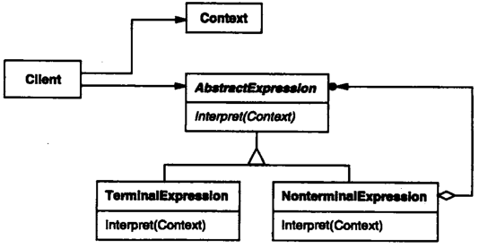

# 解释器

## 解释器模式解决什么问题？

- 问题: 需要解析一种自定义文法, 并按文法对语句求值;
- 解法: 为文法中的每条规则建立表达式类, 用表达式对象组成的树表示语句, 递归求值;
- 收益: 文法规则与解释逻辑一一对应, 新增规则只需新增表达式类;

## 解释器模式包含哪些角色？

- AbstractExpression: 定义抽象语法树中所有节点的解释操作;
- TerminalExpression: 定义终结符(文法中的最小单位)的解释操作;
- NonterminalExpression: 定义非终结符的解释操作, 内部持有子表达式;
- Context: 解释时需要的上下文信息;
- Client: 按文法构建出抽象语法树;

## 为什么实现解释器需要编译原理知识？

- 前置: 词法分析把字符串切成记号, 语法分析按文法把记号组织成抽象语法树;
- 关键概念: 终结符、非终结符、递归下降与节点求值顺序;
- 边界: 文法复杂或性能敏感时, 解释器模式会让类数量迅速膨胀, 通常改用语法分析工具生成;
