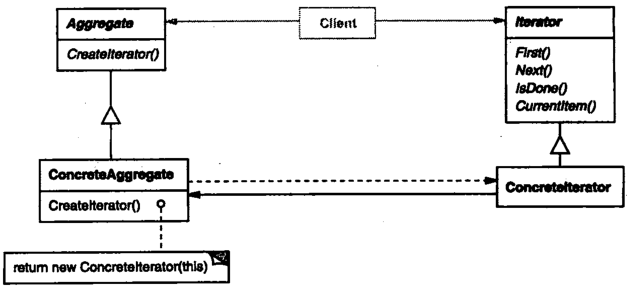

# 迭代器

## 迭代器模式解决什么问题？

- 问题: 需要遍历对象内部元素, 又不希望暴露内部表示;
- 解法: 把遍历状态从聚合对象中抽出来, 放进独立的迭代器对象;
- 收益: 不同聚合结构可以提供同一套遍历接口, 调用方不关心底层是数组还是链表;

## 迭代器模式包含哪些角色？

- Iterator: 迭代器接口, 定义取首元素、取下一元素、判断结束、取当前元素;
- ConcreteIterator: Iterator 的具体实现, 保存遍历位置;
- Aggregate: 声明创建 Iterator 的接口, 可以不实现;
- ConcreteAggregate: 实现 Aggregate, 负责创建对应的迭代器;



## 如何用 TypeScript 实现迭代器模式？

```typescript
class RadioStation {
  constructor(private frequency: number) {}

  getFrequency(): number {
    return this.frequency;
  }
}

interface Iterator<T> {
  first(): T | null;
  next(): T | null;
  isDone(): boolean;
  currentItem(): T | null;
}

class RadioStationIterator implements Iterator<RadioStation> {
  private counter = 0;

  constructor(private stations: RadioStation[]) {}

  currentItem(): RadioStation | null {
    return this.isDone() ? null : this.stations[this.counter];
  }

  first(): RadioStation | null {
    this.counter = 0;
    return this.currentItem();
  }

  next(): RadioStation | null {
    this.counter += 1;
    return this.currentItem();
  }

  isDone(): boolean {
    return this.counter >= this.stations.length;
  }
}
```

## 如何使用迭代器模式？

```typescript
const iterator = new RadioStationIterator([new RadioStation(1), new RadioStation(2)]);

iterator.currentItem()?.getFrequency(); // 1
iterator.next()?.getFrequency(); // 2
iterator.next(); // null
iterator.isDone(); // true
```

- 边界: 迭代器持有聚合的引用与游标, 遍历期间修改聚合会导致结果不确定;
