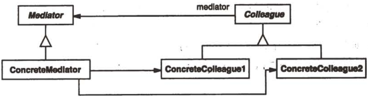

# 中介者

## 中介者模式解决什么问题？

- 问题: 多个对象之间互相直接引用, 交互关系变成网状, 难以复用与修改;
- 解法: 引入中介者统一承接对象间的交互, 同事对象只与中介者通信;
- 收益: 交互逻辑集中在一处, 同事对象之间保持低耦合;

## 中介者模式包含哪些角色？

- Mediator: 定义中介者接口;
- ConcreteMediator: 实现 Mediator, 负责转发与协调;
- Colleague: 同事类接口, 用组合持有 Mediator;
- ConcreteColleague: 实现 Colleague, 通过 Mediator 发送请求;



## 如何用 TypeScript 实现中介者模式？

```typescript
interface ChatRoomMediator {
  showMessage(user: User, message: string): void;
}

class ChatRoom implements ChatRoomMediator {
  showMessage(user: User, message: string): void {
    console.log(`${user.getName()}: ${message}`);
  }
}

interface IUser {
  getName(): string;
  send(message: string): void;
}

// Colleague: 只认识中介者
class User implements IUser {
  constructor(
    private name: string,
    private mediator: ChatRoomMediator,
  ) {}

  getName() {
    return this.name;
  }

  send(message: string): void {
    this.mediator.showMessage(this, message);
  }
}
```

## 如何使用中介者模式？

```typescript
const mediator = new ChatRoom();
const john = new User("john", mediator);
const jake = new User("Jake", mediator);

john.send("Hello"); // john: Hello
jake.send("Hey"); // Jake: Hey
```

- 边界: 中介者集中了所有交互, 复杂系统中容易演变成上帝对象, 需要按职责拆分;
