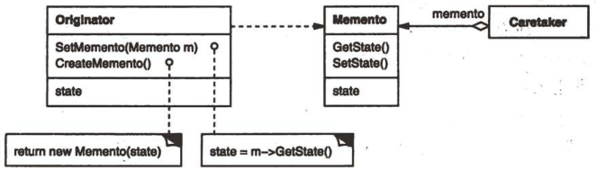

# 备忘录

## 备忘录模式解决什么问题？

- 问题: 需要保存对象某一时刻的内部状态并在之后恢复, 又不能破坏对象的封装;
- 解法: 由对象自己把状态封进备忘录快照, 外部只负责保存与取回, 不读取内容;
- 收益: 状态恢复能力与封装性同时保留;

## 备忘录模式包含哪些角色？

- Memento: 存储对象内部状态的快照;
- Originator: 原发器, 负责创建备忘录与用备忘录恢复状态;
- Caretaker: 备忘录管理者, 只保存与取回, 不访问备忘录内容;



## 如何用 TypeScript 实现备忘录模式？

```typescript
// Memento: 快照
class Memento {
  constructor(private state: string) {}

  getState(): string {
    return this.state;
  }
}

// Originator: 状态的拥有者与恢复者
class Editor {
  private state = "";

  setState(state: string) {
    this.state = state;
  }
  getState() {
    return this.state;
  }
  save(): Memento {
    return new Memento(this.state);
  }
  restore(memento: Memento) {
    this.state = memento.getState();
  }
}

// Caretaker: 只做保存与取回
class History {
  private stack: Memento[] = [];

  push(memento: Memento) {
    this.stack.push(memento);
  }
  pop(): Memento | undefined {
    return this.stack.pop();
  }
}
```

## 如何使用备忘录模式？

```typescript
const editor = new Editor();
const history = new History();

editor.setState("hello world");
history.push(editor.save());

editor.setState("changed");
editor.restore(history.pop()!);

editor.getState(); // hello world
```

- 边界: 备忘录数量与快照体积会累积, 需要限制历史深度或只保存差异;
