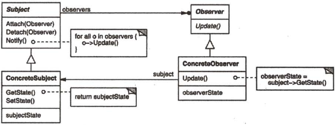

# 观察者

## 观察者模式解决什么问题？

- 问题: 一个对象的状态变化后, 依赖它的对象需要得到通知并更新;
- 解法: 目标对象维护观察者集合, 状态变化时逐个调用观察者的更新方法;
- 收益: 目标不需要知道观察者的具体类型, 只依赖观察者接口;

## 观察者模式包含哪些角色？

- Subject: 目标, 提供注册与删除观察者的接口;
- ConcreteSubject: Subject 的具体实现, 保存状态并在变化时通知;
- Observer: 观察者接口, 定义更新方法;
- ConcreteObserver: 实现 Observer, 持有目标引用并保存自己关心的状态;



## 如何用 TypeScript 实现观察者模式？

```typescript
interface Subject {
  attach(observer: Observer): void;
  detach(observer: Observer): void;
  notify(): void;
  getJob(): string[];
}

interface Observer {
  update(subject: Subject): void;
}

// ConcreteSubject: 状态变化后主动通知
class JobAgency implements Subject {
  private observers = new Set<Observer>();
  private jobs: string[] = [];

  attach(observer: Observer): void {
    this.observers.add(observer);
  }
  detach(observer: Observer): void {
    this.observers.delete(observer);
  }
  notify(): void {
    for (const observer of this.observers) {
      observer.update(this);
    }
  }
  addJob(job: string): void {
    this.jobs.push(job);
  }
  getJob(): string[] {
    return this.jobs;
  }
}

// ConcreteObserver: 从目标拉取自己关心的状态
class JobSeek implements Observer {
  private jobs: string[] = [];

  update(subject: Subject): void {
    this.jobs = subject.getJob();
  }
  getJobs(): string[] {
    return this.jobs;
  }
}
```

## 如何使用观察者模式？

```typescript
const agency = new JobAgency();
const jake = new JobSeek();
const john = new JobSeek();

agency.attach(jake);
agency.attach(john);

agency.addJob("worker");
agency.notify();

jake.getJobs(); // ["worker"]
john.getJobs(); // ["worker"]
```

- 边界: 观察者集合是强引用, 忘记 `detach` 会导致观察者无法回收; 通知过程通常需要防重入;
