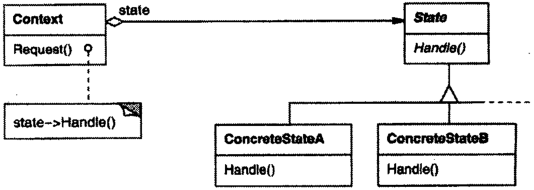

# 状态

## 状态模式解决什么问题？

- 问题: 对象的行为随内部状态改变而改变, 用条件分支处理会让逻辑随状态数量膨胀;
- 解法: 把每个状态封装成独立的类, 环境对象把与状态相关的请求委托给当前状态对象;
- 收益: 状态转移与状态行为都内聚在状态类里, 环境对象不再堆叠分支;

## 状态模式包含哪些角色？

- Context: 环境, 保存当前 State 实例, 把请求转发给它;
- State: 状态接口, 声明与某个状态对应的一组动作;
- ConcreteState: 实现 State, 决定该状态下各动作的结果与下一个状态;



## 如何用 TypeScript 实现状态模式？

```typescript
interface PhoneState {
  pickUp(): PhoneState;
  hangUp(): PhoneState;
  dial(): PhoneState;
}

class HangUp implements PhoneState {
  pickUp(): PhoneState {
    return new PickUp();
  }
  hangUp(): PhoneState {
    console.log("already hang up");
    return this;
  }
  dial(): PhoneState {
    console.log("unable to dial in hang up state");
    return this;
  }
}

class PickUp implements PhoneState {
  pickUp(): PhoneState {
    console.log("already picked up");
    return this;
  }
  hangUp(): PhoneState {
    return new HangUp();
  }
  dial(): PhoneState {
    return new Dialing();
  }
}

class Dialing implements PhoneState {
  pickUp(): PhoneState {
    console.log("already picked up");
    return this;
  }
  hangUp(): PhoneState {
    return new HangUp();
  }
  dial(): PhoneState {
    console.log("already dialing");
    return this;
  }
}

// Context: 只负责把动作交给当前状态, 并接住返回的新状态
class Phone {
  private state: PhoneState = new HangUp();

  pickUp() {
    this.state = this.state.pickUp();
  }
  hangUp() {
    this.state = this.state.hangUp();
  }
  dial() {
    this.state = this.state.dial();
  }
}
```

## 如何使用状态模式？

```typescript
const phone = new Phone();
phone.dial(); // unable to dial in hang up state
phone.pickUp();
phone.dial();
phone.hangUp();
```

- 状态流转: 由状态对象的方法返回下一个状态, 环境对象不做转移判断, 见上例 `PickUp.hangUp()`;
