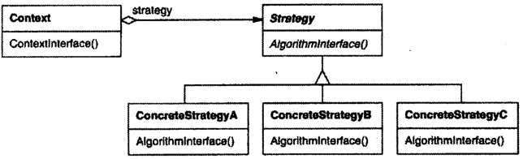

# 策略

## 策略模式解决什么问题？

- 问题: 同一种行为有多种实现, 且在运行时才能决定用哪一种;
- 解法: 把每种实现抽成独立的策略类, 上下文组合一个策略并把请求转发给它;
- 收益: 新增实现只需新增策略类, 上下文的行为分支消失;

## 策略模式包含哪些角色？

- Strategy: 策略接口;
- ConcreteStrategy: Strategy 的具体实现, 一种实现一个类;
- Context: 上下文, 用组合持有 Strategy 并把请求转发给它;



## 如何用 TypeScript 实现策略模式？

```typescript
interface SortStrategy {
  sort(dataset: number[]): number[];
}

class BubbleSortStrategy implements SortStrategy {
  sort(dataset: number[]): number[] {
    console.log("Sorting using bubble sort");
    return [...dataset].sort((a, b) => a - b);
  }
}

class QuickSortStrategy implements SortStrategy {
  sort(dataset: number[]): number[] {
    console.log("Sorting using quick sort");
    return [...dataset].sort((a, b) => a - b);
  }
}

// Context: 不关心具体算法, 只负责转发
class Sorter {
  constructor(private strategy: SortStrategy) {}

  sort(dataset: number[]): number[] {
    return this.strategy.sort(dataset);
  }
}
```

## 策略对象如何选择与注入？

- 创建: 由工厂方法按条件返回具体 ConcreteStrategy, 见 [工厂方法](../020-创建型/010-工厂方法.md);
- 注入: 通过依赖注入把策略交给 Context, 见 [控制反转与依赖注入](../010-基础/050-控制反转与依赖注入.md);
- 转发: Context 把用户请求转给当前策略, 自身不含算法分支;

## 如何使用策略模式？

```typescript
new Sorter(new BubbleSortStrategy()).sort([1, 3, 4, 2]);
// Sorting using bubble sort; [1, 2, 3, 4]

new Sorter(new QuickSortStrategy()).sort([1, 4, 3, 2]);
// Sorting using quick sort; [1, 2, 3, 4]
```
