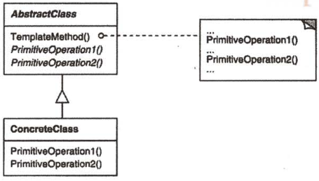

# 模板方法

## 模板方法模式解决什么问题？

- 问题: 多个子类共享同一套算法骨架, 只有部分步骤不同;
- 解法: 抽象类实现不可变部分(骨架流程), 把可变部分声明为抽象方法;
- 收益: 流程只写一次, 子类只填空, 且流程的顺序无法被基层子类打乱;

## 模板方法模式包含哪些角色？

- AbstractClass: 定义模板方法(固定流程)与若干抽象步骤;
- ConcreteClass: 实现抽象步骤, 提供该变体的具体行为;



## 如何用 TypeScript 实现模板方法模式？

```typescript
abstract class Builder {
  // 不可变部分: 固定流程
  build() {
    this.test();
    this.lint();
    this.assemble();
    this.deploy();
  }

  // 可变部分: 交给子类实现
  protected abstract test(): void;
  protected abstract lint(): void;
  protected abstract assemble(): void;
  protected abstract deploy(): void;
}

class AndroidBuilder extends Builder {
  protected test() {
    console.log("Running android tests");
  }
  protected lint() {
    console.log("Linting the android code");
  }
  protected assemble() {
    console.log("Assembling the android build");
  }
  protected deploy() {
    console.log("Deploying android build to server");
  }
}

class IosBuilder extends Builder {
  protected test() {
    console.log("Running ios tests");
  }
  protected lint() {
    console.log("Linting the ios code");
  }
  protected assemble() {
    console.log("Assembling the ios build");
  }
  protected deploy() {
    console.log("Deploying ios build to server");
  }
}
```

## 如何使用模板方法模式？

```typescript
new AndroidBuilder().build();
// Running android tests → Linting the android code → Assembling → Deploying
new IosBuilder().build();
// Running ios tests → Linting the ios code → Assembling → Deploying
```

- 相关: 子类只实现可变步骤而无法改写流程, 是"继承复用"少数不易出错的用法, 与组合复用的取舍见 [组合优于继承](../010-基础/030-组合优于继承.md);
