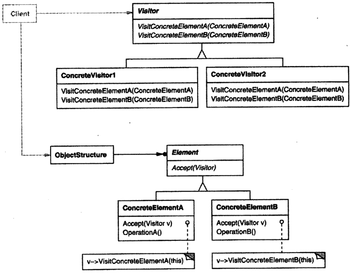

# 访问者

## 访问者模式解决什么问题？

- 问题: 对象结构基本稳定, 但需要不断为它增加新的操作;
- 解法: 把操作从元素中抽出来放进访问者, 元素只提供一个接受访问者的入口;
- 收益: 新增操作只需新增访问者, 不需要改动任何元素类;

## 访问者模式包含哪些角色？

- Visitor: 访问者接口, 为每种被访问的元素声明一个方法;
- ConcreteVisitor: 实现 Visitor, 一种操作一个访问者;
- Element: 元素接口, 声明 `accept` 接收访问者;
- ConcreteElement: 实现 Element, 在 `accept` 中把访问者导向自己的方法;
- ObjectStructure: 枚举元素的容器, 可以不实现;



## 如何用 TypeScript 实现访问者模式？

```typescript
interface AnimalVisitor {
  visitMonkey(monkey: Monkey): void;
  visitLion(lion: Lion): void;
}

interface Animal {
  accept(visitor: AnimalVisitor): void;
}

class Monkey implements Animal {
  shout() {
    console.log("Ooh oo aa aa!");
  }

  accept(visitor: AnimalVisitor): void {
    visitor.visitMonkey(this);
  }
}

class Lion implements Animal {
  roar() {
    console.log("Roaaar!");
  }

  accept(visitor: AnimalVisitor): void {
    visitor.visitLion(this);
  }
}

// ConcreteVisitor: 一种操作一个访问者
class Speak implements AnimalVisitor {
  visitMonkey(monkey: Monkey): void {
    monkey.shout();
  }
  visitLion(lion: Lion): void {
    lion.roar();
  }
}
```

## 为什么需要 accept 与 visit 两次调用？

- 原因: 单靠多态只能按一个类型分派, 而这里结果同时取决于元素类型与访问者类型;
- 流程: 调用 `element.accept(visitor)` 先按元素类型分派, `accept` 内部再调用 `visitor.visitX(this)` 按访问者类型分派;
- 名称: 该机制常称为双重分派;

## 如何使用访问者模式？

```typescript
const speak = new Speak();

new Monkey().accept(speak); // Ooh oo aa aa!
new Lion().accept(speak); // Roaaar!
```

- 边界: 增加新的元素类型需要修改所有访问者接口; 访问者适合"元素稳定、操作多变"的场景;
