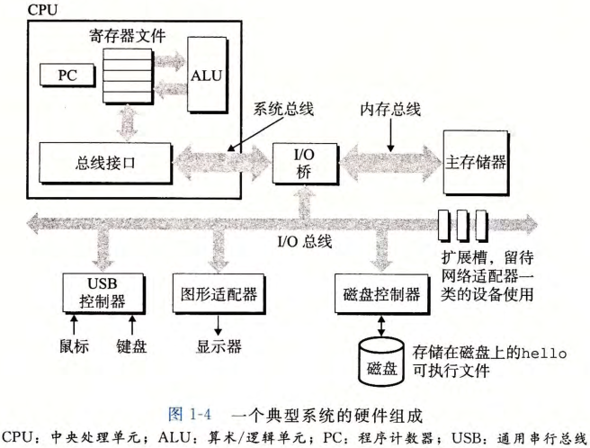
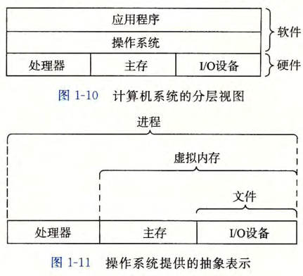

# 编译系统与硬件组成

## 文本文件和二进制文件有什么区别？

- 文本文件: 只由 ASCII 字符构成的文件;
- 二进制文件: 其他所有文件;
- 判定口径: 看内容是否只由字符编码构成;

## 一个程序从源码到可执行文件经过哪些阶段？

- 预处理: 展开宏、处理注释和头文件;
- 编译: 把高级语言翻译成汇编语言;
- 汇编: 把汇编语言翻译成机器语言, 产出可重定位目标文件;
- 链接: 合并多个目标文件与库, 产出可执行文件;

```text
源码 .c → [预处理器] → .i → [编译器] → .s → [汇编器] → .o → [链接器] → 可执行文件
```

## 计算机硬件由哪些部分组成？

| 部件 | 职责                                 |
| ---- | ------------------------------------ |
| 总线 | 在部件之间传递定长字节块, 块长为字长 |
| I/O  | 输入输出设备, 通过控制器与总线连接   |
| 主存 | 临时存储设备, 存放程序和数据         |
| CPU  | 解释或执行内存中的指令               |

- 字: 总线上一次传递的字节块长度, 典型为 32 位或 64 位;



## 操作系统在硬件和程序之间做什么？

- 定位: 程序不直接操作硬件, 而是通过操作系统提供的抽象;
- 抽象: 文件表示 I/O 设备, 虚拟内存表示主存, 进程表示处理器;



## 并发有哪些层次？

- 展开: 见 [并发与并行的层次](../040-异常与并发/070-并发与并行的层次.md);
