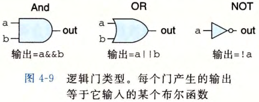
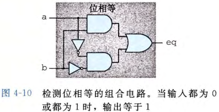
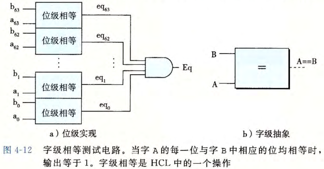
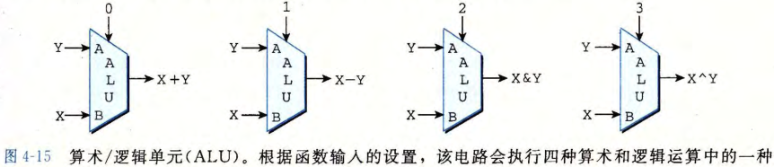
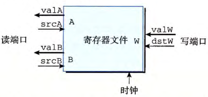

# 逻辑电路与 HCL

## 逻辑门实现哪些布尔函数？

- 逻辑门: 数字电路的基本单元, 按布尔函数把若干输入位映射为输出位;
- 类型: 与门、或门、非门;



## 组合电路由什么组成？

- 组合电路: 若干逻辑门连接成的一个网;
- 特性: 输出只由当前输入决定, 不保存状态;
- 多路复用器: 根据控制信号从多路数据信号中选出一路;



## HCL 布尔表达式怎样描述电路？

- HCL: 硬件控制语言, 用布尔表达式描述组合电路的行为;

```c
bool Eq = (a && b) || (!a && !b);
(a && !a) && func(b, c)   // 恒为 0, 该电路永远输出 0
```

## 字级电路与 HCL 整数表达式是什么？

- 字级组合电路: 对整字而不是单个位进行运算的电路;



- HCL 整数表达式: 用选择表达式描述多路复用的取值规则;

```c
word Out4 = [
    !s1 && !s0 : A; # 00
    !s1       : B; # 01
    !s0       : C; # 10
    1         : D; # 11
];
```

## 算术逻辑单元做什么？

- ALU: 执行算术运算与逻辑运算的组合电路;



## 组合电路和时序电路有什么区别？

- 组合电路: 无状态, 输出只依赖输入;
- 时序电路: 有状态, 状态由时钟控制更新;
- 时钟: 周期性信号, 控制 PC、条件码与内存的装载;

## 寄存器文件是什么？

- 寄存器文件: 存储机器级寄存器的存储电路;
- 端口: 多个读端口加一个写端口, 由时钟控制读写;
- 视角差异: 机器语言把寄存器当作可寻址的字, 硬件中它只是组合电路里的一部分存储;


