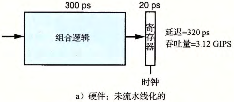
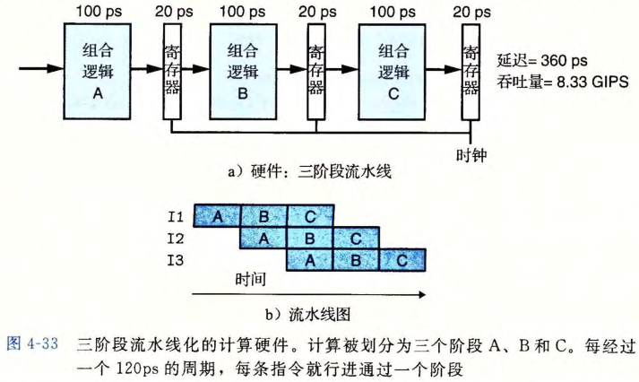
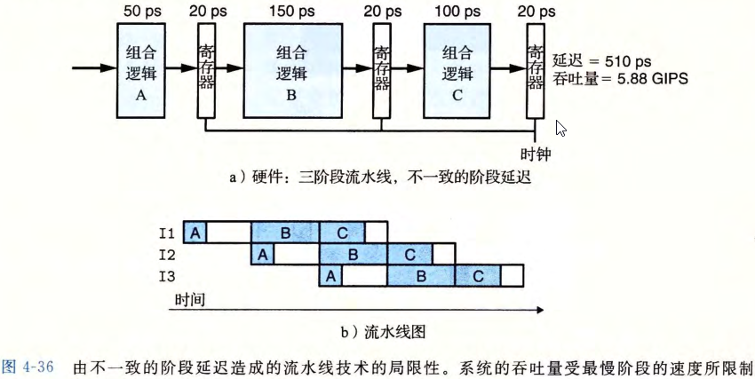
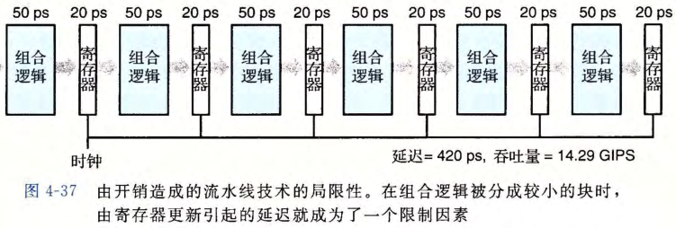

# 指令执行与流水线

## 处理器执行一条指令经过哪些阶段？

- 取指: 从内存读取指令字节;
- 译码: 从寄存器文件读出指令所需操作数;
- 执行: ALU 完成指令要求的运算;
- 访存: 读写内存;
- 写回: 把结果写回寄存器文件;
- 更新: 计算下一条指令地址并写入程序计数器;
- 时序: 各阶段的动作由时钟统一节拍;

## 非流水线和流水线化有什么区别？

- 非流水线: 一条计算走完全部阶段后才开始下一条, 各阶段轮流空闲;

- 流水线化: 把计算划分为若干阶段, 用流水线寄存器保存阶段之间的临时结果;
- 效果: 每个时钟周期有一条指令离开阶段 A 进入阶段 B, 同时有一条新指令进入阶段 A;

## 流水线为什么提高吞吐量却增加延迟？

- 延迟: 执行一条指令所需的时间;
- 吞吐量: 单位时间完成的指令数, 是延迟的倒数;
- 收益: 各阶段并行工作, 让吞吐量接近最慢阶段的速度;
- 代价: 流水线寄存器本身带来额外延迟, 单条指令并不更快;

## 流水线有哪些局限？

| 局限           | 后果                                     |
| -------------- | ---------------------------------------- |
| 阶段划分不一致 | 时钟周期由最慢阶段决定, 其他阶段空闲等待 |
| 流水线过深     | 流水线寄存器的开销迅速增大               |

