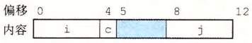

# 数组与结构体的机器表示

## 一维数组怎样访问元素？

- 布局: 元素在内存中连续存放;
- 寻址: 用两个寄存器分别保存起始地址和偏移量;
- 地址: 第 i 个元素的地址等于起始地址加上 $i\times$ 元素大小;

## 多维数组怎样计算元素地址？

- 存储顺序: 行优先, 先连续存第 0 行, 再存第 1 行;
- 对 $m\times n$ 的数组, $D[i][j]$ 的地址为 $x+L\,(n\,i+j)$;
- $x$ 是起始地址, $L$ 是数组元素类型的大小;
- 寻址: 同样用起始地址加偏移量的方式访问;

## 定长数组和变长数组有什么区别？

- 定长数组: 维度在编译时确定, 编译器可以把偏移直接算成常量;
- 变长数组: 维度在运行时才确定, 偏移必须在运行时计算;

## 结构体和联合体在内存中怎样布局？

- 结构体: 把不同类型对象聚合为一个对象, 编译器维护首字节地址以及每个字段的偏移;
- 联合体: 同一块内存按多种类型之一解释, 大小等于最大字段的大小;

## 为什么要做数据对齐？

- 规则: 类型对象的地址必须是 2、4 或 8 的倍数;
- 目的: 提高内存访问性能;
- 表现: 结构体中字段之间会插入填充字节以满足对齐要求;

