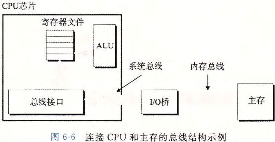
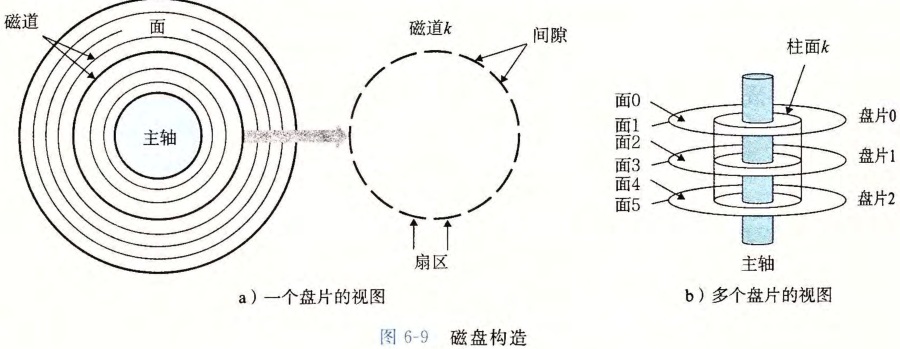
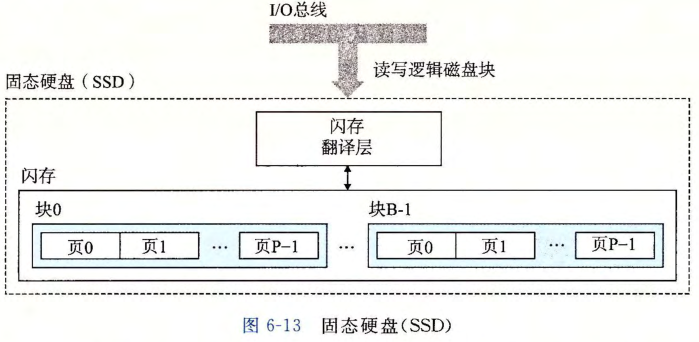

# 存储技术与总线

## RAM 有哪几种，分别用在哪里？

| 类型 | 特点           | 典型用途   |
| ---- | -------------- | ---------- |
| SRAM | 读取快、容量小 | CPU 内部   |
| DRAM | 容量大、速度慢 | 主存、显存 |

- 易失性: RAM 断电后信息丢失;
- 内存控制器: DRAM 芯片连接到内存控制器, 由这块组合电路完成读写;
- 内存模块: 多片 DRAM 封装成内存模块插在主板上;

## 总线连接了哪些部件？

- 语义: 一组并行导线, 在计算机系统的各个部分之间传递信息;
- 系统总线: 连接 CPU 与 I/O 桥;
- 内存总线: 连接内存与 I/O 桥;
- I/O 总线: 连接 I/O 设备与 I/O 桥;

## 磁盘和固态硬盘各有什么特点？

- 磁盘: 机械结构, 速度慢、容量大、寿命长;
  - 由若干盘片构成, 每个盘片有一组同心的磁道, 磁道划分为若干扇区;
- 固态硬盘: 由若干闪存和闪存翻译层构成, 速度慢于内存, 寿命较低;

## ROM 和 RAM 有什么区别？

- ROM: 断电后仍然保存信息;
- 命名误差: 部分 ROM 实际可读写, 只是沿用只读存储器的名字;
