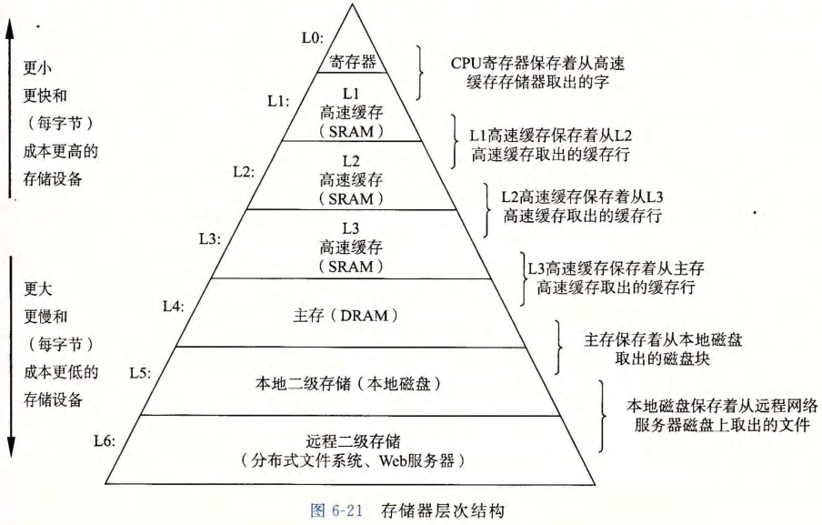

# 高速缓存与存储层次

## 高速缓存是什么？

- 定义: 相对小而快速的存储设备, 第 k 层作为第 k+1 层的缓存;
- 传输单位: 数据以块的形式在相邻两层之间传递;
- 范围: 这里指 CPU 与主存之间的 SRAM 缓存, 分为 L1、L2、L3 等多级;

## 命中与不命中分别会发生什么？

- 命中: 第 k+1 层的数据正好缓存在第 k 层, 直接取用;
- 不命中: 数据不在第 k 层, 需要从第 k+1 层读取并覆盖第 k 层的某个块;
- 替换策略: 随机替换, 或替换最少使用的块;

## 衡量缓存性能的指标有哪些？

| 指标       | 含义                              |
| ---------- | --------------------------------- |
| 命中率     | 访问落在缓存中的比例              |
| 不命中率   | 访问不在缓存中的比例              |
| 命中时间   | 从缓存向 CPU 传输一个字所需的时间 |
| 不命中惩罚 | 因不命中而额外付出的时间          |

## 存储器层次结构为什么有效？

- 结构: 每一层都作为下一层的缓存;
- 规律: 层级越高, 单位容量越贵、速度越快、空间越小;

