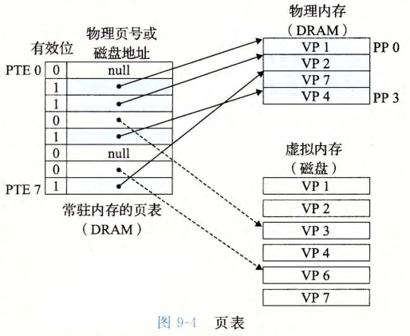

# 虚拟内存与页表

## 虚拟内存是什么？

- 定义: 对内存的抽象, 为每个进程提供私有的内存空间;
- 结构: 由连续的字节组成的数组, 内容存放在磁盘上;
- 索引: 每个字节有唯一的虚拟地址, 作为这个数组的下标;

## 页是什么？

- 页: 磁盘与内存之间的传输单元, 作用类似缓存中的块;
- 虚拟页: 虚拟内存中的页;
- 物理页 (帧): 物理内存中的页;

## 虚拟页有哪几种状态？

| 状态   | 含义                             |
| ------ | -------------------------------- |
| 未分配 | 尚未创建的页                     |
| 已缓存 | 已分配且已缓存在物理内存中的页   |
| 未缓存 | 已分配但尚未缓存在物理内存中的页 |

## 页表做什么？

- 页表项 (PTE): 记录虚拟页的状态与位置;
  - 已缓存: 保存物理页号;
  - 未缓存: 保存磁盘地址;
  - 未分配: 无有效映射;
- 翻译: 内存管理单元 (MMU) 查询页表, 完成虚拟地址到物理地址的翻译;
- 保护: 页表项同时记录访问权限, 实现内存保护功能;

## 页命中和缺页有什么区别？

- 页命中: 目标页已缓存在物理内存, 翻译流程直接完成;
- 缺页: 目标页不在物理内存, 触发缺页异常, 由内核把页从磁盘调入内存后重新执行该指令;
