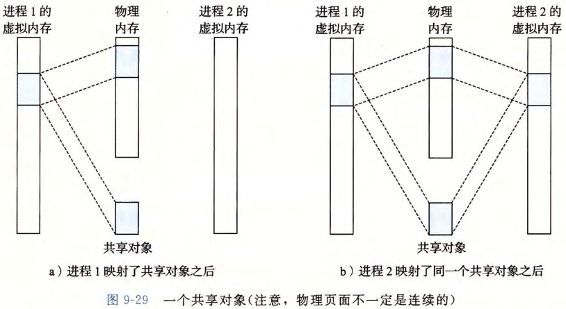
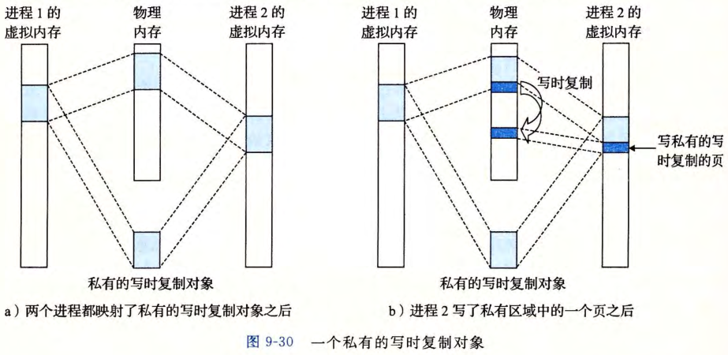

# 内存映射与动态内存分配

## 内存映射是什么？

- 定义: 把一个虚拟内存区域与磁盘上的某个对象关联起来;
- 对象类型: 普通文件或匿名文件;
- 交换: 虚拟内存一旦初始化, 由内核维护的交换文件负责换入换出;

## 共享对象和私有对象有什么区别？

- 共享对象: 同一份物理内存被多个进程的虚拟地址空间映射;
  - 一个进程的写操作对其他进程可见;
  - 写操作会修改磁盘上的原始对象;

- 私有对象: 同一份物理内存被多个进程的虚拟地址空间映射, 但写操作对其他进程不可见, 也不修改磁盘上的原始对象;
- 写时复制: 私有对象依赖写时复制保证隔离, 只有发生写操作时才真正复制页面;

## 动态内存分配器做什么？

- 堆: 动态内存分配器维护的进程虚拟内存区域;
- 结构: 一组不同大小的块的集合, 供程序在运行时申请与释放;
- 对比: 效率低于栈上的分配;
