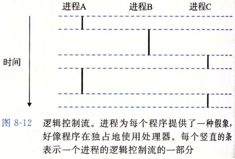
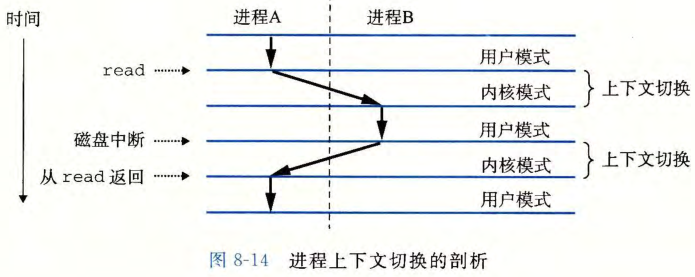

# 进程与上下文切换

## 进程是什么？

- 定义: 操作系统进行资源分配和调度的基本单位;
- 关系: 程序运行在某个进程的上下文中;
- 标识: 进程用 pid 标识;

## 逻辑控制流是什么？

- 假想: 进程让程序以为自己独占处理器;
- 实现: CPU 用程序计数器在多个进程之间轮流执行;
- 逻辑控制流: 一个进程看到的 PC 值序列;
- 并发流: 一个逻辑流与另一个逻辑流在时间上重叠;

## 进程的私有地址空间是什么？

- 假想: 进程让程序以为自己独占内存;
- 实现: 进程为每个程序提供自己的私有地址空间, 其他进程无法读写;

## 用户模式和内核模式有什么区别？

- 目的: 限制程序可以执行的指令, 以及可以访问的地址空间范围;
- 内核模式: 可以执行指令集中的任何指令;
- 用户模式: 不能直接控制内核, 只能通过系统调用接口间接控制;
- 切换: 应用程序初始运行在用户模式, 发生异常时进入内核模式处理, 处理完返回用户模式;

## 上下文切换怎样实现进程调度？

- 上下文: 每个进程维护的一份进程状态;
- 调度: 内核调度器依据上下文切换, 从一个进程跳到另一个进程;
- 代价: 切换期间系统临时进入内核模式;

## 僵死进程和进程组是什么？

- 僵死进程: 已经终止但尚未被内核清除的进程, 等待父进程回收;
- 进程组: 每个进程属于一个进程组, 用 gid 标识; 子进程属于父进程的进程组;
