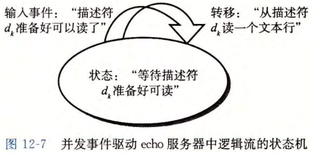

# 基于进程与 I/O 多路复用的并发

## 基于进程的并发怎样工作？

- 流程: 父进程接受请求, 为每个请求创建子进程提供服务;
- 共享: 父子进程共享文件表, 但不共享用户地址空间;
- 代价: 进程之间通信必须使用 IPC 机制, 开销大;

## I/O 多路复用是什么？

- 机制: 内核挂起进程, 等到若干个 I/O 事件发生之后, 再把控制返回给应用程序;
- 用途: 让单进程可以同时等待多个描述符, 从而处理多个连接;

## 事件驱动并发怎样把逻辑流写成状态机？

- 状态机: 一组状态、输入事件和转移的集合;
- 转移: 把「当前状态, 输入事件」映射到输出状态;
- 并发方式: 用 I/O 多路复用等待描述符可读, 可读时驱动对应状态机做一次转移;

## 事件驱动的优缺点是什么？

- 优势: 运行在单一进程上下文中, 每个逻辑流都能访问该进程的全部地址空间;
- 缺点: 需要把逻辑流改写成状态机, 代码复杂;
