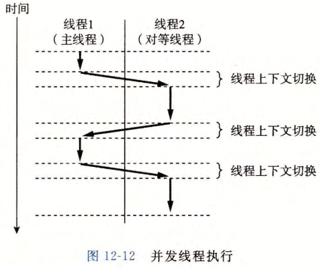

# 线程执行模型

## 线程是什么？

- 定义: 操作系统进行运算的基本单位, 是运行在进程上下文中的逻辑流;
- 上下文: 每个线程有自己的线程上下文, 同时共享所在进程的进程上下文;

## 主线程和对等线程有什么区别？

- 主线程: 进程开始执行时的那个线程;
- 对等线程: 区别于主线程的其他线程;
- 关系: 同一进程中的线程是并列关系, 没有父子之分;

## 线程切换为什么比进程切换快？

- 机制: 通过线程上下文切换来调度同一进程中的不同线程;
- 结论: 线程上下文切换的速度快于进程上下文切换;
