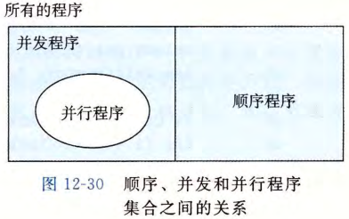

# 并发与并行的层次

## 线程级并发是什么？

- 定义: 多个线程的逻辑流在时间上重叠执行;
- 超线程: 让 CPU 在一个时钟周期中执行多个线程的技术;

## 指令级并行是什么？

- 定义: 处理器在一个时钟周期内执行多条指令;
- 与流水线的关系: 见 [指令执行与流水线](../020-汇编与处理器/030-指令执行与流水线.md);

## 单指令多数据并行是什么？

- 定义: 一条指令同时完成对多个数据的同一个操作;

## 顺序程序、并发程序和并行程序有什么区别？

- 顺序程序: CPU 按顺序执行指令;
- 并发程序: 多个逻辑流在时间上重叠执行的程序;
- 并行程序: 在多核上同时调度多个线程的程序, 是并发的一种;

