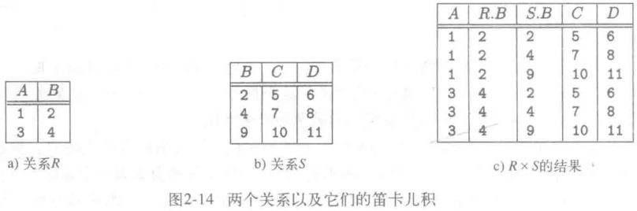
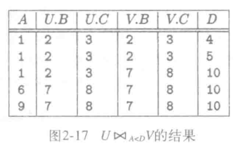
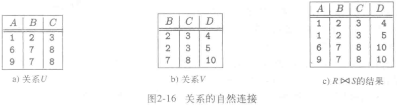

# 笛卡尔积与连接

## 笛卡尔积 $R \times S$ 产生什么？

- 结果: 全部有序对的集合;
- 有序对的前半部分: R 中的任一元组;
- 有序对的后半部分: S 中的任一元组;
- 规模: 结果元组数为 $|R| \times |S|$, 属性为两侧属性之和;
- 命名冲突: 两个关系有同名属性时需要按关系名限定;

## $\theta$ 连接 $R \Join_C S$ 怎样由笛卡尔积得到？

- 定义: 先求 $R \times S$, 再从中挑选满足条件 C 的元组;
- 公式: $R \Join_C S = \sigma_C(R \times S)$;
- 条件 C: 比较两个关系属性的表达式, 支持 $=, <>, <, >, \le, \ge$;

## 自然连接 $R \Join S$ 与 $\theta$ 连接有什么区别？

- 定义: 把 R 与 S 在所有共有属性上取值相同的元组配对;
- 公式: $R \Join S = \pi_L(\sigma_C(R \times S))$, 其中 C 是共有属性的等值条件, L 是去掉重复共有属性后的属性表;
- 区别: 自然连接的条件由模式自动推导, 且结果不重复保留共有属性; $\theta$ 连接的条件由用户给出, 属性全部保留;

（source: 010-关系数据模型.md §代数查询语言/§笛卡尔积/§自然连接/§θ 连接）
