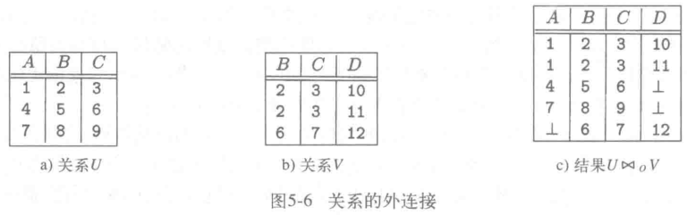
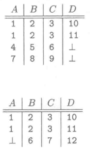

# 外连接

## 什么是悬浮元组？

- 定义: 连接过程中无法在另一侧找到匹配的元组;
- 后果: 普通连接会直接丢弃这些元组, 匹配信息随之丢失;
- 处理: 外连接保留悬浮元组;

## 外连接与普通连接有什么区别？

- 基础: 与对应的连接相同, 先按条件匹配元组;
- 差异: 无法匹配的悬浮元组仍然保留;
- 补值: 悬浮元组在缺失的一侧用 `NULL` 补齐;

## 左外连接、右外连接与全外连接分别保留哪一侧？

| 类型     | 保留的悬浮元组         |
| -------- | ---------------------- |
| 左外连接 | 只保留左表的悬浮元组   |
| 右外连接 | 只保留右表的悬浮元组   |
| 全外连接 | 保留两侧的全部悬浮元组 |

- SQL 写法: 见 [连接](../030-SQL/070-连接.md);

（source: 010-关系数据模型.md §包/§外连接）
