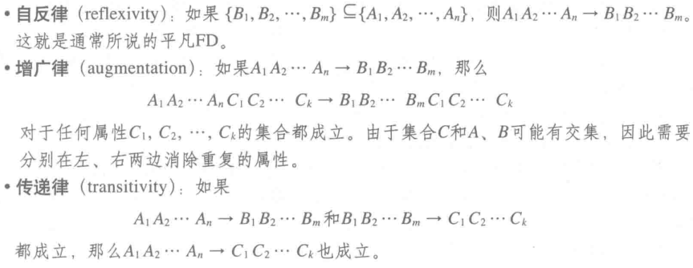

# 函数依赖规则

## 分解规则与结合规则说什么？

- 分解规则: $A_1A_2\cdots A_n \rightarrow B_1B_2\cdots B_m$ 蕴含每个 $A_1A_2\cdots A_n \rightarrow B_i$;
- 结合规则: 每个 $A_1A_2\cdots A_n \rightarrow B_i$ 蕴含 $A_1A_2\cdots A_n \rightarrow B_1B_2\cdots B_m$;
- 结论: 左右两边的属性组可以按需拆开或合并, 语义等价;

## 传递规则说什么？

- 规则: 若 $A_1A_2\cdots A_n \rightarrow B_1B_2\cdots B_m$ 且 $B_1B_2\cdots B_m \rightarrow C_1C_2\cdots C_k$, 则 $A_1A_2\cdots A_n \rightarrow C_1C_2\cdots C_k$;
- 作用: 从已知依赖推导新依赖;

## Armstrong 公理包含哪三条？

| 公理                | 内容                                                                                                         |
| ------------------- | ------------------------------------------------------------------------------------------------------------ |
| 自反律 reflexivity  | 若 $\{B_1,\dots,B_m\} \subseteq \{A_1,\dots,A_n\}$, 则 $A_1\cdots A_n \rightarrow B_1\cdots B_m$, 即平凡依赖 |
| 增广律 augmentation | 若 $A_1\cdots A_n \rightarrow B_1\cdots B_m$, 则左右同时加入任意属性集 $C_1\cdots C_k$ 后仍成立              |
| 传递律 transitivity | 若 $A \rightarrow B$ 且 $B \rightarrow C$, 则 $A \rightarrow C$                                              |

- 增广律注意点: $C$ 与 $A$、$B$ 可能有交集, 因此需要分别在左右两边消除重复属性;
- 用途: 判定范式时用来推导属性闭包;

（source: 020-关系数据库设计理论.md §函数依赖规则/§Armstrong 公理）
