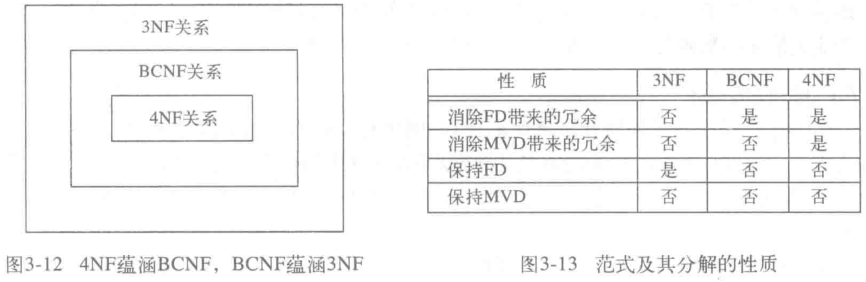

# 范式概览

## 范式之间是什么关系？

- 包含关系: 4NF 关系蕴含 BCNF 关系, BCNF 关系蕴含 3NF 关系;
- 方向: 范式级别越高, 约束越严, 满足的关系越少;
- 路径: 1NF → 2NF → 3NF → BCNF → 4NF;

## 不同范式在冗余与依赖保持上如何取舍？

| 性质                | 3NF | BCNF | 4NF |
| ------------------- | --- | ---- | --- |
| 消除 FD 带来的冗余  | 否  | 是   | 是  |
| 消除 MVD 带来的冗余 | 否  | 否   | 是  |
| 保持 FD             | 是  | 否   | 否  |
| 保持 MVD            | 否  | 否   | 否  |

## 为什么没有既消除全部冗余又保持全部依赖的范式？

- 3NF: 能保持函数依赖, 但允许键的子集出现在依赖右边, 因此仍存在冗余;
- BCNF / 4NF: 消除对应类型的冗余, 却可能丢失原有的函数依赖;
- 取舍: 分解时只能在"少冗余"与"保依赖"之间选一侧;
- 结论: 范式级别不是越高越好, 要按查询与更新模式选择;

## 各级范式分别要求什么？

- [第一范式与第二范式](./030-第一范式与第二范式.md);
- [第三范式](./040-第三范式.md);
- [BCNF](./050-BCNF.md);
- [第四范式](./060-第四范式.md);

（source: 020-关系数据库设计理论.md §函数范式/§范式的联系）
