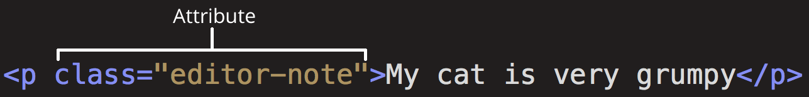

# 元素属性

## 标签属性写在什么位置？

- 位置: 开始标签内, 标签名之后;
- 结构: 属性名 + `=` + 引号包裹的属性值, 多个属性用空格分隔;



```html
<p class="editor-note">My cat is very grumpy</p>
```

## 属性什么时候可以只写名字？

- 布尔属性: 出现即表示开启, 不写值;
- 等价写法: `controls` 与 `controls="controls"` 等价, 关闭则完全省略该属性;
- 例子: `controls`、`autoplay`、`muted`、`checked`、`required`、`multiple`、`allowfullscreen`、`default`;

```html
<video src="myVideo.mp4" controls muted></video> <input type="checkbox" name="subscribe" checked />
```

## id 属性有什么要求与用途？

- 取值: 不能包含空白字符, 同一文档内唯一;
- 定位: CSS 用 `#value` 选中, 脚本用 `id=value` 查询;
- 交叉引用: 其他元素的 `for`、`list`、`headers` 等属性都填 id 值;

```html
<p id="exciting">The most exciting paragraph on the page. One of a kind!</p>
```

- 具体引用场景见 [表单元素](../040-表格与表单/040-表单元素.md) 与 [单元格合并与关联](../040-表格与表单/020-单元格合并与关联.md);

## 自定义属性如何声明与读取？

- 声明: `data-` 前缀 + 自定义名称, 如 `data-xxx`;
- 读取: 用 `getAttribute("data-xxx")` 或 `dataset` 取值;
- 用途: 存放属于该元素的私有数据, 不参与标准语义;

```html
<div data-xxx="xxx"></div>
```
