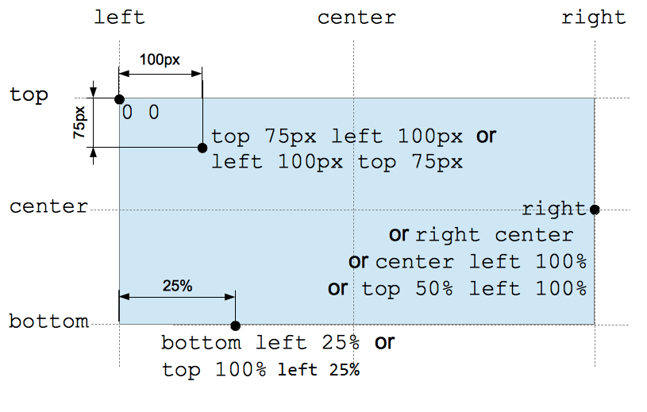

# 颜色图像与位置类型

## color 类型有哪些写法？

```css
background-color: red; /* 关键字 */
background-color: #ff0000; /* 十六进制 */
background-color: rgb(255, 0, 0); /* rgb */
background-color: rgb(255, 0, 153, 1); /* rgba */
background-color: hsl(0, 100%, 50%); /* hsl */
background-color: hsl(0, 100%, 50%, 1); /* hsla */
```

- 透明: `transparent` 表示完全透明;

## 渐变色如何书写？

- 渐变: 由颜色函数生成的 image 类型值;

```css
background: radial-gradient(red, yellow, rgb(30, 144, 255));
background: repeating-radial-gradient(powderblue, powderblue 8px, white 8px, white 16px);
```

## image 类型有哪些来源？

- `url()`: 引用图片文件;
- 渐变函数: `linear-gradient`、`radial-gradient` 等;

```css
background-image: url("star.gif");
background-image: linear-gradient(#f69d3c, #3f87a6);
```

## position 值类型如何表示偏移？

- 组成: 关键字 (`left`/`right`/`top`/`bottom`/`center`)、length、percentage;
- 方向: 左上角为起点, 右与下为正方向;



## position 的多值语法如何解析？

| 参数个数 | 含义                                              |
| -------- | ------------------------------------------------- |
| 1        | 关键字: keyword + 另一轴 center; 值: x + y center |
| 2        | keyword+keyword: 各自对应方向; value+value: x+y   |
| 4        | 每对 keyword value, value 表示对应方向偏移        |

```css
background-position: right 3em bottom 2em;
```
